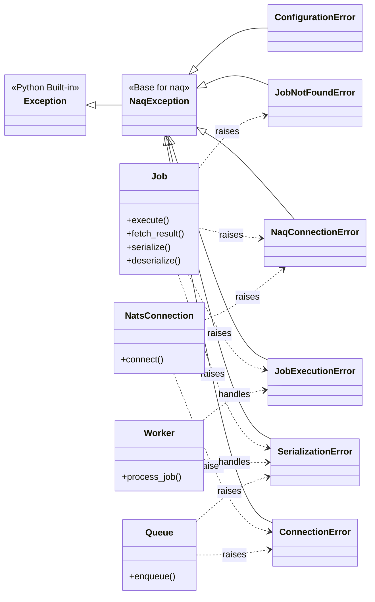

# Analysis of `src/naq/exceptions.py`

## 1. Module Overview and Role

The [`src/naq/exceptions.py`](src/naq/exceptions.py) module defines a set of custom exception classes for the `naq` library. Its primary role is to provide a structured and specific way to handle errors that can occur within various components of the `naq` system, such as connection issues, configuration problems, job processing failures, and serialization errors. By defining a hierarchy of exceptions, the module facilitates more precise error handling, clearer debugging, and consistent error reporting across the library.

The module defines:
*   A base exception `NaqException` ([`src/naq/exceptions.py:4`](src/naq/exceptions.py:4)) from which all other custom `naq` exceptions inherit.
*   Specific exception classes for different error scenarios.

## 2. Public Interfaces

All public interfaces in this module are exception classes. They inherit from Python's built-in `Exception` class via the custom `NaqException` ([`src/naq/exceptions.py:4`](src/naq/exceptions.py:4)) base class.

*   **`NaqException(Exception)` ([`src/naq/exceptions.py:4`](src/naq/exceptions.py:4))**:
    *   **Description**: Base exception class for `naq`. All other exceptions defined in this module inherit from it.
    *   **Signature**: `class NaqException(Exception): pass`

*   **`ConnectionError(NaqException)` ([`src/naq/exceptions.py:10`](src/naq/exceptions.py:10))**:
    *   **Description**: Raised when there's an issue connecting to NATS.
    *   **Signature**: `class ConnectionError(NaqException): pass`
    *   *Note*: There is also a `NaqConnectionError`. The distinction or potential overlap should be considered.

*   **`ConfigurationError(NaqException)` ([`src/naq/exceptions.py:16`](src/naq/exceptions.py:16))**:
    *   **Description**: Raised for configuration issues within the `naq` library.
    *   **Signature**: `class ConfigurationError(NaqException): pass`

*   **`SerializationError(NaqException)` ([`src/naq/exceptions.py:22`](src/naq/exceptions.py:22))**:
    *   **Description**: Raised when job serialization or deserialization fails.
    *   **Signature**: `class SerializationError(NaqException): pass`

*   **`JobExecutionError(NaqException)` ([`src/naq/exceptions.py:28`](src/naq/exceptions.py:28))**:
    *   **Description**: Raised when a job fails during its execution by a worker.
    *   **Signature**: `class JobExecutionError(NaqException): pass`

*   **`JobNotFoundError(NaqException)` ([`src/naq/exceptions.py:34`](src/naq/exceptions.py:34))**:
    *   **Description**: Raised when a job is not found (e.g., when trying to fetch its result or status).
    *   **Signature**: `class JobNotFoundError(NaqException): pass`

*   **`NaqConnectionError(NaqException)` ([`src/naq/exceptions.py:40`](src/naq/exceptions.py:40))**:
    *   **Description**: Raised when NATS connection fails.
    *   **Signature**: `class NaqConnectionError(NaqException): pass`
    *   *Note*: As mentioned for `ConnectionError`, the specific difference or intended use case compared to `ConnectionError` could be clarified. It might be intended for more specific NATS-related connection issues versus general connection problems.

## 3. Key Functionalities

The primary functionality of this module is to provide a well-defined hierarchy of custom exceptions. This allows different parts of the `naq` library to:
*   **Signal Specific Errors**: Raise exceptions that clearly indicate the nature of the problem (e.g., a `SerializationError` ([`src/naq/exceptions.py:22`](src/naq/exceptions.py:22)) vs. a `JobExecutionError` ([`src/naq/exceptions.py:28`](src/naq/exceptions.py:28))).
*   **Enable Targeted Handling**: Allow client code and internal `naq` components to catch and handle specific types of errors differently. For instance, a `ConnectionError` ([`src/naq/exceptions.py:10`](src/naq/exceptions.py:10)) might trigger a retry mechanism, while a `JobExecutionError` ([`src/naq/exceptions.py:28`](src/naq/exceptions.py:28)) might lead to logging the error and moving the job to a failed queue.
*   **Standardize Error Reporting**: Ensure consistency in how errors are reported and propagated throughout the system.
*   **Improve Debuggability**: Custom exceptions make it easier to trace the origin and type of errors during development and troubleshooting.

The module itself does not contain complex logic or workflows; its role is purely declarative, defining the exception types.

## 4. Dependencies and Interactions

*   **Internal Dependencies**:
    *   The exception classes within [`src/naq/exceptions.py`](src/naq/exceptions.py) are self-contained in their definitions, with more specific exceptions inheriting from `NaqException` ([`src/naq/exceptions.py:4`](src/naq/exceptions.py:4)).

*   **External Dependencies**:
    *   **Python's `Exception` class**: The base `NaqException` ([`src/naq/exceptions.py:4`](src/naq/exceptions.py:4)) directly inherits from Python's built-in `Exception`.

*   **Interactions with Other `naq` Modules**:
    The exceptions defined in this module are raised and potentially caught by various other modules in the `naq` library. Key interactions include:
    *   **[`src/naq/job.py`](src/naq/job.py)**:
        *   May raise `SerializationError` ([`src/naq/exceptions.py:22`](src/naq/exceptions.py:22)) during job or result serialization/deserialization.
        *   `Job.execute()` ([`src/naq/job.py:238`](src/naq/job.py:238)) raises `JobExecutionError` ([`src/naq/exceptions.py:28`](src/naq/exceptions.py:28)) if the job's function fails.
        *   Methods like `fetch_result()` ([`src/naq/job.py:305`](src/naq/job.py:305)) can raise `JobNotFoundError` ([`src/naq/exceptions.py:34`](src/naq/exceptions.py:34)), `JobExecutionError` ([`src/naq/exceptions.py:28`](src/naq/exceptions.py:28)) (if the fetched job had failed), `NaqConnectionError` ([`src/naq/exceptions.py:40`](src/naq/exceptions.py:40)), or other `NaqException` ([`src/naq/exceptions.py:4`](src/naq/exceptions.py:4)) subtypes for NATS issues.
    *   **[`src/naq/connection.py`](src/naq/connection.py)**:
        *   Functions interacting with NATS (e.g., `get_nats_connection`, `get_jetstream_context`) may raise `ConnectionError` ([`src/naq/exceptions.py:10`](src/naq/exceptions.py:10)) or `NaqConnectionError` ([`src/naq/exceptions.py:40`](src/naq/exceptions.py:40)) if NATS is unavailable or connection fails.
    *   **[`src/naq/queue.py`](src/naq/queue.py)**:
        *   Could raise connection-related exceptions (`ConnectionError` ([`src/naq/exceptions.py:10`](src/naq/exceptions.py:10)), `NaqConnectionError` ([`src/naq/exceptions.py:40`](src/naq/exceptions.py:40))) when trying to publish jobs if the NATS connection is down.
        *   Might raise `SerializationError` ([`src/naq/exceptions.py:22`](src/naq/exceptions.py:22)) if job serialization fails before enqueueing.
    *   **[`src/naq/worker.py`](src/naq/worker.py)**:
        *   Handles `JobExecutionError` ([`src/naq/exceptions.py:28`](src/naq/exceptions.py:28)) from `job.execute()`.
        *   May encounter and handle `SerializationError` ([`src/naq/exceptions.py:22`](src/naq/exceptions.py:22)) when deserializing jobs.
        *   May encounter and handle `ConnectionError` ([`src/naq/exceptions.py:10`](src/naq/exceptions.py:10)) or `NaqConnectionError` ([`src/naq/exceptions.py:40`](src/naq/exceptions.py:40)) during its NATS interactions.
    *   **[`src/naq/settings.py`](src/naq/settings.py)** (or modules consuming settings):
        *   Could raise `ConfigurationError` ([`src/naq/exceptions.py:16`](src/naq/exceptions.py:16)) if settings are invalid or missing.
    *   **[`src/naq/cli.py`](src/naq/cli.py)**:
        *   The CLI might catch various `NaqException` ([`src/naq/exceptions.py:4`](src/naq/exceptions.py:4)) subtypes to provide user-friendly error messages.

## 5. Notable Implementation Details

*   **Base Exception Class**: The use of `NaqException` ([`src/naq/exceptions.py:4`](src/naq/exceptions.py:4)) as a common base class is a good practice, allowing users to catch all `naq`-specific exceptions with a single `except NaqException:` block if desired.
*   **Simplicity of Definitions**: The exception classes are currently defined with `pass`, relying on their names and docstrings to convey their meaning. They do not add custom attributes or override `__init__` or `__str__` methods. This is a common and acceptable approach for simple error signaling.
*   **Naming Convention**: The exceptions follow a clear `Error` suffix convention (e.g., `ConnectionError`, `SerializationError`).
*   **Potential Ambiguity**: The presence of both `ConnectionError` ([`src/naq/exceptions.py:10`](src/naq/exceptions.py:10)) and `NaqConnectionError` ([`src/naq/exceptions.py:40`](src/naq/exceptions.py:40)) with very similar descriptions ("issue connecting to NATS" vs. "NATS connection fails") could lead to confusion. It would be beneficial to clarify their distinct use cases or consolidate them if their purposes overlap significantly. This might be a historical artifact or intended for different layers of abstraction.

## 6. Mermaid Diagram

This diagram illustrates the inheritance hierarchy of the custom exceptions defined in [`src/naq/exceptions.py`](src/naq/exceptions.py), all deriving from `NaqException` ([`src/naq/exceptions.py:4`](src/naq/exceptions.py:4)), which itself is a subclass of Python's base `Exception`. It also shows illustrative interactions where other `naq` components might raise or handle these specific exceptions.