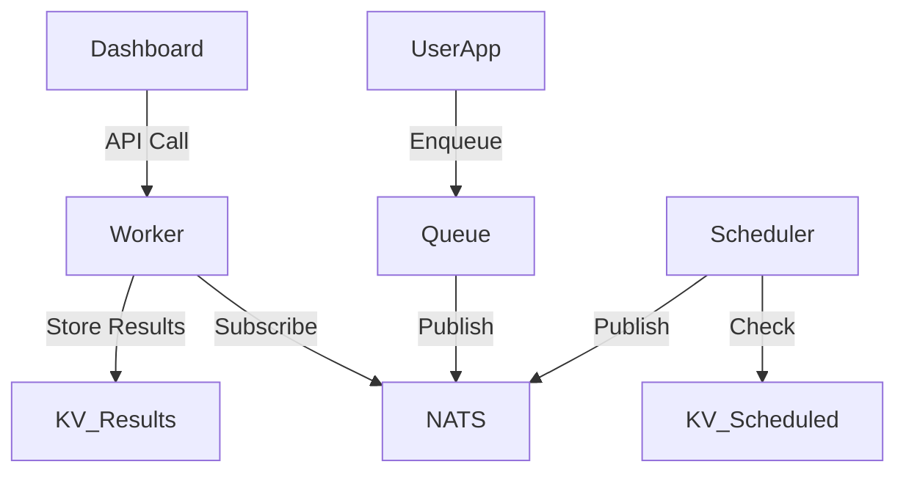
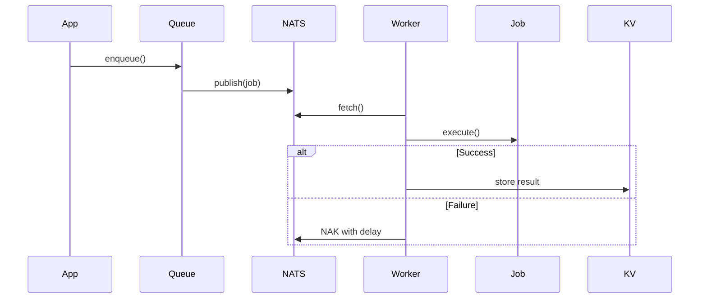

# NAQ Library Architecture

## 1. Overview
NAQ (NATS Asynchronous Queue) is a simple, lightweight distributed task queue built on NATS JetStream. It provides:

- Job enqueueing with retries and dependencies
- Worker processing with concurrency control
- Scheduled and recurring tasks
- Result storage and retrieval
- Web dashboard for monitoring

## 2. High-Level Directory Structure
```
naq/
├── src/
│   ├── naq/
│   │   ├── queue.py        # Queue management
│   │   ├── job.py          # Job definition
│   │   ├── worker.py       # Worker implementation  
│   │   ├── scheduler.py    # Scheduled job polling
│   │   ├── connection.py   # NATS connection mgmt
│   │   ├── settings.py     # Configuration
│   │   ├── exceptions.py   # Custom exceptions
│   │   ├── cli.py          # Command-line interface
│   │   └── dashboard/      # Web UI
│   │       ├── app.py
│   │       └── templates/
│   │           └── dashboard.html
├── examples/               # Usage examples
├── docs/                   # Documentation
├── docker/                 # Docker configs
├── pyproject.toml          # Project config
└── README.md               # Project overview
```

## 3. Core Components

### 3.1 Connection (`src/naq/connection.py`)
**Responsibilities**:
- Manages NATS connections and JetStream contexts
- Ensures required streams exist with proper configuration

**Key Interfaces**:
```python
async def get_nats_connection(url: str) -> NATSClient
async def get_jetstream_context(nc: NATSClient) -> JetStreamContext  
async def ensure_stream(js: JetStreamContext, stream_name: str, subjects: list[str])
```

**Interactions**:
- Used by all components needing NATS communication
- Creates streams with WORK_QUEUE retention policy

### 3.2 Job (`src/naq/job.py`)
**Responsibilities**:
- Defines the Job class representing work units
- Handles serialization using cloudpickle
- Manages execution, retries, and dependencies

**Key Interfaces**:
```python
class Job:
    def __init__(self, function, args, kwargs, max_retries=0, retry_delay=0, ...)
    def execute(self) -> Any
    def serialize(self) -> bytes
    @classmethod 
    def deserialize(cls, data: bytes) -> "Job"
    @staticmethod
    async def fetch_result(job_id: str, nats_url: str) -> Any
```

**Interactions**:
- Created by Queue when enqueueing jobs
- Executed by Worker processes
- Uses Connection for result fetching

### 3.3 Queue (`src/naq/queue.py`)
**Responsibilities**:
- Enqueues jobs to NATS streams
- Manages scheduled jobs via NATS KV store
- Provides queue management operations

**Key Interfaces**:
```python
class Queue:
    async def enqueue(self, func, *args, **kwargs) -> Job
    async def enqueue_at(self, dt: datetime, func, *args, **kwargs) -> Job  
    async def schedule(self, func, *args, cron=None, interval=None, **kwargs) -> Job
    async def purge(self) -> int
```

**Interactions**:
- Creates Job instances
- Stores scheduled jobs in NATS KV
- Publishes jobs to NATS streams

### 3.4 Worker (`src/naq/worker.py`)
**Responsibilities**:
- Fetches and executes jobs
- Handles retries and failures
- Reports status via heartbeats

**Key Interfaces**:
```python
class Worker:
    def __init__(self, queues: list[str], concurrency: int = 10)
    async def run(self)
    @staticmethod
    async def list_workers(nats_url: str) -> list[dict]
```

**Interactions**:
- Consumes jobs from NATS streams
- Updates job status in NATS KV
- Stores results in NATS KV

### 3.5 Scheduler (`src/naq/scheduler.py`)
**Responsibilities**:
- Polls for due scheduled jobs
- Implements leader election for HA
- Enqueues ready jobs

**Key Interfaces**:
```python
class Scheduler:
    def __init__(self, enable_ha: bool = True)
    async def run(self)
    @property
    def is_leader(self) -> bool
```

**Interactions**:
- Reads from scheduled jobs KV store
- Publishes ready jobs to queues
- Uses leader election KV

### 3.6 Dashboard (`src/naq/dashboard/`)
**Responsibilities**:
- Web UI for monitoring workers
- Shows queue status and job history

**Endpoints**:
- `GET /` - Dashboard page
- `GET /api/workers` - Worker status API

## 4. Architectural Diagrams

### 4.1 Component Interaction


### 4.2 Job Lifecycle


## 5. Configuration & Deployment

### 5.1 Configuration
Configure via:
- `settings.py` defaults
- Environment variables:
  - `NAQ_NATS_URL`
  - `NAQ_JOB_SERIALIZER`
  - `NAQ_RESULT_TTL`

### 5.2 Deployment
1. Run NATS with JetStream:
```bash
docker-compose -f docker/docker-compose.yml up
```

2. Start workers:
```bash
naq worker queue1 queue2 --concurrency 5
```

3. Start scheduler:
```bash 
naq scheduler --enable-ha
```

4. Start dashboard:
```bash
naq dashboard
```

## 6. References
- [Job Module Analysis](docs/job_module_analysis.md)
- [Dashboard Analysis](docs/dashboard_analysis.md)

## 7. Async-First with Sync Interface Design

This section summarizes the design principles, implementation techniques, and performance considerations for creating Python libraries that are async-first but also provide a synchronous interface for broader usability.

### 7.1. Core Concepts
- An "async-first" library builds its primary logic using asynchronous paradigms (`async`/`await`, `asyncio`, `anyio`) for efficient I/O-bound operations and high concurrency.
- A "sync interface" exposes functions/methods that can be called from synchronous code, typically by running the underlying asynchronous operations in a separate thread.

### 7.2. Design Best Practices
- **Async Core, Sync Wrapper:** Implement core logic asynchronously; provide sync wrappers for public API.
- **Clear Naming:** Use conventions (e.g., `async_func()`, `func_sync()`) to distinguish async/sync versions.
- **Minimal Sync Interface:** Only expose sync versions for operations that genuinely benefit from it.
- **Consistent Error Handling:** Ensure exceptions propagate correctly across interfaces.
- **Documentation:** Clearly document both APIs and their usage.

### 7.3. Implementation Techniques
The primary method for bridging async to sync involves running the asynchronous code in a separate thread.
- **`asyncio.run()`:** Suitable for simple, single calls to an async function from a synchronous context, automatically managing the event loop for that call.
- **`anyio.run()` (Recommended for most library sync wrappers):** Provides a clean, backend-agnostic way to run an async function from a sync context. It handles event loop management and thread execution robustly.
- **`anyio.from_thread.BlockingPortal` (For advanced, persistent interaction):** Used when a synchronous thread needs to persistently interact with an `anyio` event loop running in another thread (e.g., controlling a long-running async worker, sending multiple commands to a single async instance). It provides a more advanced, persistent communication channel than `anyio.run()`.

### 7.4. Relevant Tools and Frameworks
- **`asyncio` (Built-in):** The foundation for async programming in Python.
- **`anyio`:** A universal async I/O library that simplifies bridging async and sync code, and supports multiple async backends.
- **`trio`:** An alternative async framework, often used with `anyio`.
- Libraries like `httpx` and `SQLAlchemy` (2.0+) demonstrate effective dual async/sync API design.

### 7.5. Performance Implications
Bridging async to sync via threads introduces overhead:
- **Thread Overhead:** Creation, management, and context switching of threads have a cost.
- **Event Loop Management:** Starting/stopping event loops in threads adds overhead.
- **Data Transfer:** Costs associated with passing data between threads.
- **GIL:** The Global Interpreter Lock limits true parallelism for CPU-bound tasks, even with threads.

The overhead is generally acceptable for I/O-bound operations where the I/O wait time significantly exceeds the threading overhead. For performance-critical synchronous use cases or frequent CPU-bound operations, direct async usage or multiprocessing might be necessary. `BlockingPortal` can reduce repeated event loop startup overhead for persistent interactions.