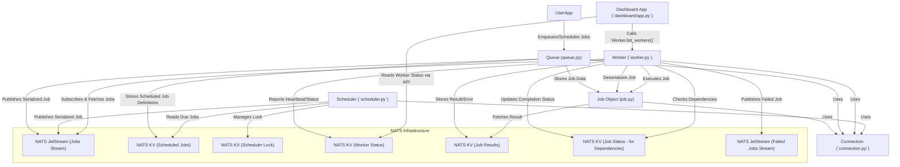
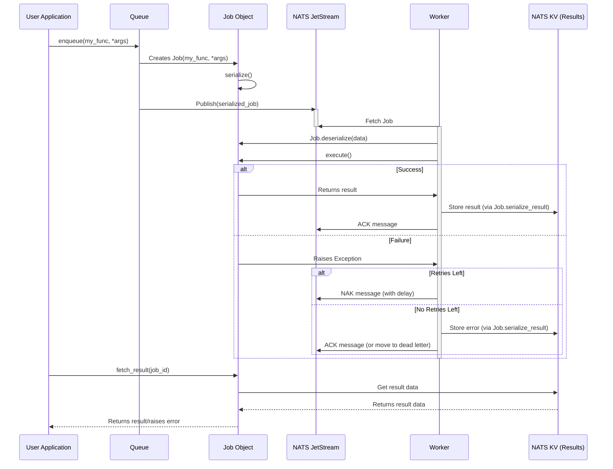
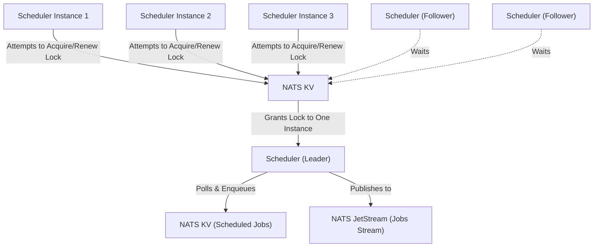

# NAQ Library Architecture Plan

This document outlines the plan for creating the comprehensive `architecture.md` document for the NAQ library.

## I. Document Outline for `architecture.md`

# NAQ Library Architecture

## 1. Overview
- Brief introduction to NAQ (NATS Asynchronous Queue).
- Purpose: Simple, lightweight, NATS-based distributed task queue.
- Core features: Job enqueueing, worker processing, scheduled tasks, job dependencies, result backend, dashboard.

## 2. High-Level Directory Structure
- `src/naq/`: Core library code.
    - `queue.py`: Queue management, job enqueueing, scheduled job management.
    - `job.py`: Job definition, serialization, execution logic.
    - `worker.py`: Worker implementation, job fetching, processing, heartbeats.
    - `scheduler.py`: Scheduled job polling, leader election for HA.
    - `connection.py`: NATS connection management.
    - `settings.py`: Default configurations and constants.
    - `exceptions.py`: Custom exceptions.
    - `cli.py`: Command-line interface.
    - `dashboard/`: Web dashboard components.
        - `app.py`: Sanic application for the dashboard.
        - `templates/`: HTML templates for the dashboard.
- `examples/`: Usage examples for various features.
- `docs/`: Documentation files (including this one).
- `docker/`: Docker-related files (e.g., `docker-compose.yml` for NATS).
- `pyproject.toml`: Project metadata, dependencies.
- `README.md`: Project overview and setup instructions.

## 3. Core Components

### 3.1. Connection (`src/naq/connection.py`)
- **Responsibilities**: Manages NATS client connections and JetStream contexts. Provides a centralized way to obtain and close connections. Ensures NATS streams are created with appropriate configurations.
- **Public Interfaces**:
    - `ConnectionManager` class (internal singleton).
    - `get_nats_connection(url) -> NATSClient`
    - `get_jetstream_context(nc) -> JetStreamContext`
    - `close_nats_connection(url)`
    - `close_all_connections()`
    - `ensure_stream(js, stream_name, subjects)`
- **Interactions**: Used by all other components (Queue, Job, Worker, Scheduler, Dashboard) that need to communicate with NATS.
- **Key Files**: [`src/naq/connection.py`](src/naq/connection.py)

### 3.2. Job (`src/naq/job.py`)
- **Responsibilities**: Defines the `Job` object, representing a unit of work. Handles serialization/deserialization of jobs and results. Encapsulates job execution logic, retry parameters, and dependency information. Provides methods to fetch job results.
- **Public Interfaces**:
    - `Job` class:
        - `__init__(function, args, kwargs, job_id, enqueue_time, max_retries, retry_delay, queue_name, depends_on, result_ttl)`
        - `execute() -> Any`
        - `get_retry_delay(attempt: int) -> float`
        - `serialize() -> bytes`
        - `deserialize(data: bytes) -> Job` (classmethod)
        - `serialize_failed_job() -> bytes`
        - `serialize_result(result, status, error, traceback_str) -> bytes` (staticmethod)
        - `deserialize_result(data: bytes) -> Dict` (staticmethod)
        - `fetch_result(job_id, nats_url) -> Any` (staticmethod, async)
        - `fetch_result_sync(job_id, nats_url) -> Any` (staticmethod)
    - `Serializer` protocol and implementations (`PickleSerializer`, `JsonSerializer` - placeholder).
    - `get_serializer() -> Serializer`
- **Interactions**:
    - `Queue`: Creates and serializes `Job` instances.
    - `Worker`: Deserializes, executes, and handles results/retries for `Job` instances.
    - `Connection`: Used by `fetch_result` to access NATS KV store for results.
    - `Settings`: Uses `JOB_SERIALIZER`, `RESULT_KV_NAME`.
- **Key Files**: [`src/naq/job.py`](src/naq/job.py)
- **Cross-reference**: See existing analysis in [`docs/job_module_analysis.md`](docs/job_module_analysis.md)

### 3.3. Queue (`src/naq/queue.py`)
- **Responsibilities**: Manages job enqueueing to NATS streams. Handles scheduling of jobs for future execution (one-time and recurring) via `ScheduledJobManager`. Provides methods to purge queues and manage scheduled jobs (cancel, pause, resume, modify).
- **Public Interfaces**:
    - `Queue` class:
        - `__init__(name, nats_url, default_timeout)`
        - `enqueue(func, *args, max_retries, retry_delay, depends_on, **kwargs) -> Job` (async)
        - `enqueue_at(dt, func, *args, **kwargs) -> Job` (async)
        - `enqueue_in(delta, func, *args, **kwargs) -> Job` (async)
        - `schedule(func, *args, cron, interval, repeat, **kwargs) -> Job` (async)
        - `purge() -> int` (async)
        - `cancel_scheduled_job(job_id) -> bool` (async)
        - `pause_scheduled_job(job_id) -> bool` (async)
        - `resume_scheduled_job(job_id) -> bool` (async)
        - `modify_scheduled_job(job_id, **updates) -> bool` (async)
    - `ScheduledJobManager` class (internal to Queue):
        - `store_job(...)`
        - `cancel_job(job_id)`
        - `update_job_status(job_id, status)`
        - `modify_job(job_id, **updates)`
    - Module-level helper functions (async and sync versions for all `Queue` methods).
- **Interactions**:
    - `Job`: Creates `Job` instances.
    - `Connection`: Uses NATS connection to publish jobs and interact with KV store for scheduled jobs.
    - `Scheduler`: The `Scheduler` component polls jobs stored by `ScheduledJobManager`.
    - `Settings`: Uses `DEFAULT_QUEUE_NAME`, `NAQ_PREFIX`, `SCHEDULED_JOBS_KV_NAME`.
- **Key Files**: [`src/naq/queue.py`](src/naq/queue.py)

### 3.4. Worker (`src/naq/worker.py`)
- **Responsibilities**: Fetches jobs from NATS queues using pull consumers. Executes jobs, handling retries, dependencies, and results. Reports its status and heartbeats. Manages concurrency.
- **Public Interfaces**:
    - `Worker` class:
        - `__init__(queues, nats_url, concurrency, worker_name, heartbeat_interval, worker_ttl)`
        - `run()` (async, main worker loop)
        - `list_workers(nats_url) -> List[Dict]` (staticmethod, async)
        - `list_workers_sync(nats_url) -> List[Dict]` (staticmethod)
    - `WorkerStatusManager` (internal): Manages heartbeats and worker registration in KV store.
    - `JobStatusManager` (internal): Checks job dependencies and updates job completion status in KV store. Stores results in KV.
    - `FailedJobHandler` (internal): Publishes terminally failed jobs to a dedicated NATS stream.
- **Interactions**:
    - `Job`: Deserializes and executes `Job` instances.
    - `Queue`: Consumes jobs from subjects associated with queues.
    - `Connection`: Uses NATS connection for subscriptions, KV store interactions.
    - `Settings`: Uses various settings for KV names, TTLs, heartbeats, status constants.
- **Key Files**: [`src/naq/worker.py`](src/naq/worker.py)

### 3.5. Scheduler (`src/naq/scheduler.py`)
- **Responsibilities**: Polls a NATS KV store for scheduled jobs. Enqueues jobs that are due to their respective queues. Supports High Availability (HA) via leader election.
- **Public Interfaces**:
    - `Scheduler` class:
        - `__init__(nats_url, poll_interval, instance_id, enable_ha)`
        - `run()` (async, main scheduler loop)
        - `is_leader -> bool` (property)
    - `LeaderElection` class (internal): Manages leader election using a NATS KV store.
    - `ScheduledJobProcessor` class (internal): Fetches due jobs from KV and enqueues them.
- **Interactions**:
    - `Queue` (`ScheduledJobManager`): Consumes scheduled job definitions stored by `Queue.schedule()`, `enqueue_at()`, `enqueue_in()`. Enqueues jobs back to the `Queue` via direct NATS publish.
    - `Connection`: Uses NATS connection for KV store interactions (scheduled jobs, leader lock) and publishing jobs.
    - `Settings`: Uses `SCHEDULED_JOBS_KV_NAME`, `SCHEDULER_LOCK_KV_NAME`, etc.
- **Key Files**: [`src/naq/scheduler.py`](src/naq/scheduler.py)

### 3.6. Dashboard (`src/naq/dashboard/`)
- **Responsibilities**: Provides a web-based UI for monitoring NAQ workers.
- **Public Interfaces (Endpoints)**:
    - `GET /`: Main dashboard HTML page.
    - `GET /api/workers`: JSON API to fetch current worker statuses.
- **Interactions**:
    - `Worker`: Calls `Worker.list_workers()` to get data for the `/api/workers` endpoint.
    - `Connection` (implicitly via `Worker`): `Worker.list_workers()` uses NATS.
- **Key Files**:
    - [`src/naq/dashboard/app.py`](src/naq/dashboard/app.py): Sanic application, route definitions.
    - [`src/naq/dashboard/templates/dashboard.html`](src/naq/dashboard/templates/dashboard.html): Main HTML template.
- **Cross-reference**: See existing analysis in [`docs/dashboard_analysis.md`](docs/dashboard_analysis.md)

## 4. Architectural Diagrams

### 4.1. High-Level Component Interaction

### 4.2. Job Lifecycle (Simplified)

*(Note: This diagram simplifies dependencies and detailed worker status updates for clarity on the job's path.)*

### 4.3. Scheduler High Availability (Leader Election)

## 5. Configuration and Deployment

### 5.1. Configuration
- **Primary Configuration**: Via `naq.settings` ([`src/naq/settings.py`](src/naq/settings.py)) which defines default values.
- **Environment Variables**: Many settings can be overridden by environment variables (e.g., `NAQ_NATS_URL`, `NAQ_JOB_SERIALIZER`). (Need to confirm which ones are explicitly supported by checking `settings.py` and usage).
- **Key Settings**:
    - `DEFAULT_NATS_URL`: NATS server address.
    - `JOB_SERIALIZER`: "pickle" (default) or "json" (future).
    - `RESULT_KV_NAME`, `SCHEDULED_JOBS_KV_NAME`, `WORKER_KV_NAME`, `JOB_STATUS_KV_NAME`, `SCHEDULER_LOCK_KV_NAME`: Names for NATS KV buckets.
    - TTLs for results, worker heartbeats, job status.
    - Heartbeat intervals.
- **Dependencies**: Core dependencies listed in [`pyproject.toml`](pyproject.toml) (`nats-py`, `cloudpickle`, `typer`, `loguru`, `croniter`, `rich`).
- **Optional Features**:
    - **Dashboard**: Requires `naq[dashboard]` installation (`datastar-py`, `jinja2`, `sanic`, etc.).

### 5.2. Deployment
- **NATS Server**: Requires a running NATS server with JetStream enabled.
    - [`docker/docker-compose.yml`](docker/docker-compose.yml) provides an example setup using `nats:2.10` image and enabling JetStream with `-js` flag.
    - Exposes client port `4222` and monitoring port `8222`.
- **NAQ Application**:
    - **Workers**: Run as separate processes, typically using the `naq worker` CLI command.
        - `naq worker my_queue another_queue --concurrency 10`
    - **Scheduler**: Run as a separate process, using `naq scheduler`. For HA, multiple instances can be run.
        - `naq scheduler --enable-ha`
    - **Dashboard**: Run as a separate process using `naq dashboard`.
        - `naq dashboard --host 0.0.0.0 --port 8000`
- **Python Environment**: Requires Python >=3.13 (as per [`pyproject.toml`](pyproject.toml)). Dependencies can be installed via `pip install naq` or `pip install naq[dashboard]`.

## 6. References
- **API Documentation**: (If [`docs/api.md`](docs/api.md) exists and is relevant, link here)
- **Examples**: See the [`examples/`](examples/) directory for usage patterns.
- **Job Module Analysis**: [`docs/job_module_analysis.md`](docs/job_module_analysis.md)
- **Dashboard Analysis**: [`docs/dashboard_analysis.md`](docs/dashboard_analysis.md)

## 7. Conclusion
- Summary of NAQ's architecture as a NATS-based distributed task queue.
- Strengths: Simplicity, leverages NATS JetStream features, Pythonic.
- Potential areas for future development (if any obvious ones emerge from this analysis, e.g., full JSON serializer implementation, more dashboard features).