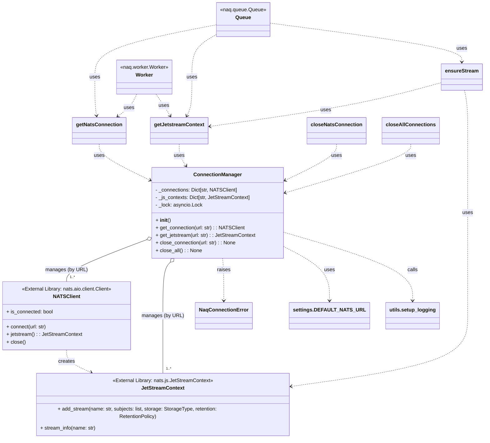

# Analysis of `src/naq/connection.py`

## 1. Module Overview and Role

The [`src/naq/connection.py`](src/naq/connection.py) module is responsible for managing all aspects of communication with NATS (and NATS JetStream) within the `naq` library. Its primary role is to provide a centralized and efficient way to establish, reuse, and manage NATS client connections and JetStream contexts. This abstraction simplifies NATS interactions for other modules in the `naq` system, such as those handling job queueing, worker processing, and result storage. It also includes functionality to ensure that necessary JetStream streams are properly configured and available.

The module defines:
*   A `ConnectionManager` class ([`src/naq/connection.py:15`](src/naq/connection.py:15)) that implements a connection pool for NATS clients and JetStream contexts.
*   A singleton instance of `ConnectionManager` ([`src/naq/connection.py:116`](src/naq/connection.py:116)) to provide global access to connection management.
*   Several asynchronous utility functions that leverage the `ConnectionManager` for common NATS operations:
    *   `get_nats_connection()` ([`src/naq/connection.py:119`](src/naq/connection.py:119))
    *   `get_jetstream_context()` ([`src/naq/connection.py:123`](src/naq/connection.py:123))
    *   `close_nats_connection()` ([`src/naq/connection.py:135`](src/naq/connection.py:135))
    *   `close_all_connections()` ([`src/naq/connection.py:139`](src/naq/connection.py:139))
    *   `ensure_stream()` ([`src/naq/connection.py:143`](src/naq/connection.py:143))

## 2. Public Interfaces

### A. `ConnectionManager` Class ([`src/naq/connection.py:15`](src/naq/connection.py:15))

Manages a pool of NATS connections and JetStream contexts, allowing reuse and centralized control.

*   **Key Attributes (Initialized in `__init__` ([`src/naq/connection.py:22`](src/naq/connection.py:22))):**
    *   `_connections: Dict[str, NATSClient]` ([`src/naq/connection.py:23`](src/naq/connection.py:23)): A dictionary caching active NATS client connections, keyed by NATS server URL.
    *   `_js_contexts: Dict[str, JetStreamContext]` ([`src/naq/connection.py:24`](src/naq/connection.py:24)): A dictionary caching active JetStream contexts, keyed by NATS server URL.
    *   `_lock: asyncio.Lock` ([`src/naq/connection.py:25`](src/naq/connection.py:25)): An asyncio lock to ensure thread-safe modifications to the connection and context caches.

*   **Key Public Methods:**
    *   `async get_connection(self, url: str = DEFAULT_NATS_URL) -> NATSClient` ([`src/naq/connection.py:27`](src/naq/connection.py:27)): Retrieves an existing, connected NATS client for the given URL from the pool, or creates, caches, and returns a new one. Raises `NaqConnectionError` on failure.
    *   `async get_jetstream(self, url: str = DEFAULT_NATS_URL) -> JetStreamContext` ([`src/naq/connection.py:57`](src/naq/connection.py:57)): Retrieves an existing JetStream context for the given URL, or creates one using an existing/new NATS connection, then caches and returns it. Raises `NaqConnectionError` on failure.
    *   `async close_connection(self, url: str = DEFAULT_NATS_URL) -> None` ([`src/naq/connection.py:86`](src/naq/connection.py:86)): Closes the NATS connection associated with the specified URL and removes it from the pool.
    *   `async close_all(self) -> None` ([`src/naq/connection.py:103`](src/naq/connection.py:103)): Closes all managed NATS connections and clears all cached connections and JetStream contexts.

### B. Module-Level Utility Functions

These functions provide a simpler interface to the `_manager` (singleton `ConnectionManager` instance).

*   `async get_nats_connection(url: str = DEFAULT_NATS_URL) -> NATSClient` ([`src/naq/connection.py:119`](src/naq/connection.py:119)): A wrapper around `_manager.get_connection()`. Gets a NATS client connection.
*   `async get_jetstream_context(nc: Optional[NATSClient] = None) -> JetStreamContext` ([`src/naq/connection.py:123`](src/naq/connection.py:123)): Gets a JetStream context. If a `NATSClient` (`nc`) is provided, it attempts to get the JetStream context directly from it. Otherwise, it uses `_manager.get_jetstream()` with the default URL.
*   `async close_nats_connection(url: str = DEFAULT_NATS_URL)` ([`src/naq/connection.py:135`](src/naq/connection.py:135)): A wrapper around `_manager.close_connection()`. Closes a specific NATS connection.
*   `async close_all_connections()` ([`src/naq/connection.py:139`](src/naq/connection.py:139)): A wrapper around `_manager.close_all()`. Closes all managed NATS connections.
*   `async ensure_stream(js: Optional[JetStreamContext] = None, stream_name: str = "naq_jobs", subjects: Optional[list[str]] = None) -> None` ([`src/naq/connection.py:143`](src/naq/connection.py:143)): Ensures that a JetStream stream with the given `stream_name` and `subjects` exists. If `js` (JetStreamContext) is not provided, it obtains one using `get_jetstream_context()`. If the stream does not exist, it creates it with `FileStorage` and `WorkQueue` retention policy. Raises `NaqConnectionError` on failure.

## 3. Key Functionalities

The `connection.py` module provides the following core functionalities:

*   **NATS Connection Management**:
    *   Establishes connections to NATS servers.
    *   Pools and reuses NATS client connections to avoid redundant connection establishments, keyed by server URL.
    *   Manages the lifecycle of connections (creation, retrieval, closing).
*   **JetStream Context Management**:
    *   Obtains JetStream contexts from established NATS connections.
    *   Caches and reuses JetStream contexts, keyed by server URL.
*   **Stream Provisioning**:
    *   Checks for the existence of NATS JetStream streams.
    *   Creates streams if they are not found, with specific configurations suitable for a task queue (e.g., `FileStorage` for persistence, `WorkQueue` retention policy for message consumption).
*   **Error Handling**:
    *   Provides a custom exception, `NaqConnectionError` ([`src/naq/exceptions.py`](src/naq/exceptions.py)), to signal connection-related issues, wrapping underlying NATS library exceptions.
*   **Concurrency Safety**:
    *   Uses `asyncio.Lock` within the `ConnectionManager` to ensure that concurrent access to shared connection and context caches is handled safely in an asynchronous environment.

## 4. Dependencies and Interactions

The `connection.py` module interacts with several other components, both internal to `naq` and external:

*   **External Libraries:**
    *   `nats` (Python NATS client): This is the primary external dependency, used for all NATS and JetStream communication (e.g., [`nats.connect()`](src/naq/connection.py:47), `nc.jetstream()`, `js.add_stream()`).
    *   `loguru`: Used for structured logging within the module (e.g., [`logger.info()`](src/naq/connection.py:48)).

*   **Internal `naq` Modules:**
    *   **[`src/naq/exceptions.py`](src/naq/exceptions.py):**
        *   Raises `NaqConnectionError` ([`src/naq/connection.py:9`](src/naq/connection.py:9)) for various connection or JetStream operation failures.
    *   **[`src/naq/settings.py`](src/naq/settings.py):**
        *   Uses `DEFAULT_NATS_URL` ([`src/naq/connection.py:10`](src/naq/connection.py:10)) as the default NATS server address if no specific URL is provided to connection functions.
    *   **[`src/naq/utils.py`](src/naq/utils.py):**
        *   Calls `setup_logging()` ([`src/naq/connection.py:11`](src/naq/connection.py:11)) at the module level ([`src/naq/connection.py:13`](src/naq/connection.py:13)) to initialize logging configuration.
    *   **Other `naq` modules (Consumers of this module):**
        *   **[`src/naq/queue.py`](src/naq/queue.py):** Would use `get_nats_connection()` and `get_jetstream_context()` to connect to NATS for publishing jobs to a stream. It would also use `ensure_stream()` to make sure the target job stream exists.
        *   **[`src/naq/worker.py`](src/naq/worker.py):** Would use `get_nats_connection()` and `get_jetstream_context()` to connect to NATS for subscribing to job streams and consuming messages.
        *   **[`src/naq/job.py`](src/naq/job.py):** As seen in its own analysis, `Job.fetch_result()` methods would use functions from this module to interact with NATS JetStream Key-Value stores for results.
        *   **[`src/naq/scheduler.py`](src/naq/scheduler.py):** Likely uses connection functions to interact with NATS for managing scheduled jobs or their metadata.

## 5. Notable Implementation Details

*   **Singleton `ConnectionManager`**: The module employs a singleton pattern by creating a single instance `_manager` ([`src/naq/connection.py:116`](src/naq/connection.py:116)) of the `ConnectionManager` class. Module-level functions then delegate to this instance, providing a global, shared connection management facility.
*   **Connection and Context Caching**: The `ConnectionManager` caches `NATSClient` objects in `_connections` ([`src/naq/connection.py:23`](src/naq/connection.py:23]) and `JetStreamContext` objects in `_js_contexts` ([`src/naq/connection.py:24`](src/naq/connection.py:24]), both keyed by the NATS server URL. This promotes reuse and reduces overhead.
*   **Asynchronous Locking**: An `asyncio.Lock` ([`src/naq/connection.py:25`](src/naq/connection.py:25]) is used to protect access to the shared `_connections` and `_js_contexts` dictionaries, ensuring safe concurrent operations in an `asyncio` environment.
*   **Graceful Connection Handling**: Connections are checked for validity (`is_connected` ([`src/naq/connection.py:42`](src/naq/connection.py:42))) before being returned from the cache. Failed connection attempts lead to cleanup of potentially partial entries.
*   **`ensure_stream` Configuration**: The `ensure_stream` function ([`src/naq/connection.py:143`](src/naq/connection.py:143)) is crucial for setting up the task queue infrastructure. It specifically configures new streams with:
    *   `storage=nats.js.api.StorageType.FILE` ([`src/naq/connection.py:168`](src/naq/connection.py:168)): Ensures job data persistence on disk.
    *   `retention=nats.js.api.RetentionPolicy.WORK_QUEUE` ([`src/naq/connection.py:169`](src/naq/connection.py:169)): Configures the stream so that messages are deleted after being successfully consumed by a worker, suitable for task queue semantics.
*   **Logging**: The module integrates `loguru` for informative logging of connection events, stream creation, and errors, aiding in diagnostics.
*   **Compatibility Layer**: The module-level functions like `get_nats_connection` provide a simpler API and backward compatibility, abstracting the direct use of the `ConnectionManager` instance.

## 6. Mermaid Diagram

