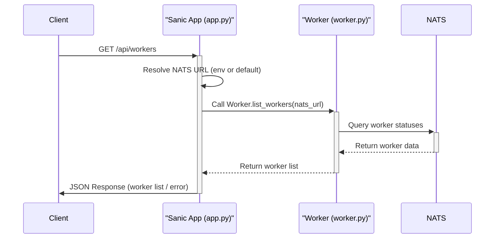

# Analysis of `src/naq/dashboard/app.py`

## 1. Module Overview and Role

The [`src/naq/dashboard/app.py`](src/naq/dashboard/app.py) module is responsible for providing a web-based dashboard for the `naq` library. It utilizes the Sanic web framework to serve HTML pages and API endpoints, offering users a visual interface to monitor aspects of their `naq` system, such as worker status.

The module sets up a Sanic application, configures templating using Jinja2 (via Sanic-Ext), integrates Datastar for potential real-time updates, and defines routes to serve the dashboard's main page and an API for fetching worker data. It also handles optional dependencies gracefully, ensuring the core `naq` library can function even if dashboard-specific extras are not installed.

The module defines:
*   A Sanic application instance: `app` ([`src/naq/dashboard/app.py:25`](src/naq/dashboard/app.py:25)).
*   Integration with `Datastar` ([`src/naq/dashboard/app.py:27`](src/naq/dashboard/app.py:27)) for real-time capabilities.
*   Configuration for Jinja2 templating via `Sanic-Ext` ([`src/naq/dashboard/app.py:30-40`](src/naq/dashboard/app.py:30-40)).
*   Route handlers for the dashboard UI and API endpoints.

## 2. Public Interfaces

### A. Sanic Application Instance

*   **`app: Sanic`** ([`src/naq/dashboard/app.py:25`](src/naq/dashboard/app.py:25))
    *   The main Sanic application instance named "NaqDashboard". This object is used to define routes, configure extensions, and run the web server.

### B. Route Handlers

*   **`index(request: sanic.request.Request) -> sanic.response.BaseHTTPResponse`** ([`src/naq/dashboard/app.py:50`](src/naq/dashboard/app.py:50))
    *   **Route**: `@app.get("/")`
    *   **Description**: Serves the main dashboard HTML page. It attempts to render the [`dashboard.html`](src/naq/dashboard/templates/dashboard.html) template using Jinja2. Includes fallback logic for template rendering if standard Sanic-Ext methods are unavailable.
    *   **Returns**: An HTML response containing the rendered dashboard page or an error message if rendering fails.

*   **`api_get_workers(request: sanic.request.Request) -> sanic.response.BaseHTTPResponse`** ([`src/naq/dashboard/app.py:81`](src/naq/dashboard/app.py:81))
    *   **Route**: `@app.get("/api/workers")`
    *   **Description**: Provides a JSON API endpoint to fetch the current status of all registered `naq` workers. It calls `Worker.list_workers()` from the [`src/naq/worker.py`](src/naq/worker.py) module.
    *   **Returns**: A JSON response containing a list of worker data or a JSON error object if fetching fails.

## 3. Key Functionalities

*   **Web-Based Dashboard Interface**: The primary function is to serve a user-friendly web interface ([`dashboard.html`](src/naq/dashboard/templates/dashboard.html)) for monitoring the `naq` system.
*   **Worker Monitoring**: Provides an API endpoint (`/api/workers`) to retrieve real-time information about active `naq` workers, which can be consumed by the dashboard frontend.
*   **Templating**: Uses Jinja2, integrated via `Sanic-Ext`, for dynamic HTML page generation. Template files are expected to be in the [`src/naq/dashboard/templates/`](src/naq/dashboard/templates/) directory.
*   **Asynchronous Operations**: Built on Sanic, an asynchronous web framework, allowing for non-blocking I/O operations, suitable for fetching data from NATS without blocking the server.
*   **Real-time Potential**: Initializes `Datastar` ([`src/naq/dashboard/app.py:27`](src/naq/dashboard/app.py:27)), suggesting capabilities for real-time updates on the dashboard, although specific real-time features beyond initialization are not detailed in the current code.
*   **Dependency Management**: Checks for optional dependencies like `datastar-py` ([`src/naq/dashboard/app.py:15-21`](src/naq/dashboard/app.py:15-21)) and `jinja2` ([`src/naq/dashboard/app.py:35-46`](src/naq/dashboard/app.py:35-46)) at startup, logging errors and potentially exiting if they are missing, guiding users to install `naq[dashboard]`.

## 4. Dependencies and Interactions

### A. External Dependencies

*   **`sanic`**: The core asynchronous web framework used to build the dashboard application.
*   **`sanic-ext`**: An extension for Sanic that provides various helpers, including Jinja2 templating support ([`src/naq/dashboard/app.py:7`](src/naq/dashboard/app.py:7), [`src/naq/dashboard/app.py:40`](src/naq/dashboard/app.py:40)).
*   **`datastar`** (Optional): A library for adding real-time, reactive components to web applications ([`src/naq/dashboard/app.py:16`](src/naq/dashboard/app.py:16)). Its presence is checked, and an error is logged if not installed.
*   **`jinja2`** (Optional): A templating engine used for rendering HTML pages ([`src/naq/dashboard/app.py:36`](src/naq/dashboard/app.py:36)). Its presence is checked for enabling templating features.
*   **`os`**: Standard library module used for `os.getenv()` ([`src/naq/dashboard/app.py:1`](src/naq/dashboard/app.py:1), [`src/naq/dashboard/app.py:87`](src/naq/dashboard/app.py:87)) to read environment variables.
*   **`sys`**: Standard library module used for `sys.exit()` ([`src/naq/dashboard/app.py:2`](src/naq/dashboard/app.py:2), [`src/naq/dashboard/app.py:21`](src/naq/dashboard/app.py:21)) when critical dependencies are missing.
*   **`pathlib`**: Standard library module used for robust path manipulation ([`src/naq/dashboard/app.py:3`](src/naq/dashboard/app.py:3), [`src/naq/dashboard/app.py:31-32`](src/naq/dashboard/app.py:31-32)).

### B. Internal `naq` Library Dependencies

*   **[`src/naq/settings.py`](src/naq/settings.py)**:
    *   Imports `DEFAULT_NATS_URL` ([`src/naq/dashboard/app.py:9`](src/naq/dashboard/app.py:9)) as a fallback NATS connection string.
*   **[`src/naq/worker.py`](src/naq/worker.py)**:
    *   Imports the `Worker` class ([`src/naq/dashboard/app.py:12`](src/naq/dashboard/app.py:12)).
    *   The `api_get_workers` endpoint calls `Worker.list_workers()` ([`src/naq/dashboard/app.py:88`](src/naq/dashboard/app.py:88)) to fetch data about active workers. This implies an interaction with the NATS server where worker heartbeats or status information is stored/published.

### C. Interactions with Environment/Configuration

*   **Environment Variable `NAQ_NATS_URL`**: The `api_get_workers` endpoint attempts to read the NATS server URL from this environment variable. If not set, it falls back to `DEFAULT_NATS_URL` from [`src/naq/settings.py`](src/naq/settings.py) ([`src/naq/dashboard/app.py:87`](src/naq/dashboard/app.py:87)).
*   **File System**:
    *   Reads template files (e.g., [`dashboard.html`](src/naq/dashboard/templates/dashboard.html)) from the `src/naq/dashboard/templates/` directory. The path to this directory is resolved dynamically ([`src/naq/dashboard/app.py:31-32`](src/naq/dashboard/app.py:31-32)).

## 5. Notable Implementation Details

*   **Dynamic Template Path Resolution**: Uses `Path(__file__).parent.resolve()` ([`src/naq/dashboard/app.py:31`](src/naq/dashboard/app.py:31)) to correctly locate the `templates` directory relative to the `app.py` file, making the application more portable.
*   **Graceful Degradation for Optional Features**: The application checks for the presence of `datastar` and `jinja2`. If not found, it logs informative errors and, in the case of `datastar`, exits, guiding the user to install necessary extras (`pip install naq[dashboard]`). This prevents crashes if the dashboard features are not fully installed.
*   **Template Rendering Fallback**: The `index` route ([`src/naq/dashboard/app.py:50`](src/naq/dashboard/app.py:50)) includes a try-except block to handle cases where `response.render` might not be available (e.g., older Sanic-Ext versions or misconfiguration), attempting a manual template rendering as a fallback ([`src/naq/dashboard/app.py:61-74`](src/naq/dashboard/app.py:61-74)). This enhances robustness.
*   **Clear Logging**: Uses `sanic.log.logger` for informative logging of operations, errors, and dependency issues (e.g., [`src/naq/dashboard/app.py:18`](src/naq/dashboard/app.py:18), [`src/naq/dashboard/app.py:52`](src/naq/dashboard/app.py:52), [`src/naq/dashboard/app.py:73`](src/naq/dashboard/app.py:73), [`src/naq/dashboard/app.py:83`](src/naq/dashboard/app.py:83)).
*   **Asynchronous Route Handlers**: All route handlers (`index`, `api_get_workers`) are defined as `async def`, leveraging Sanic's asynchronous capabilities for efficient I/O.

## 6. Mermaid Diagram

This diagram illustrates the flow for the `/api/workers` endpoint and key components involved.



```mermaid
classDiagram
    class SanicApp {
        +app: Sanic
        +config
        +get("/") index()
        +get("/api/workers") api_get_workers()
    }

    class Datastar {
        +__init__(app: Sanic)
    }
    SanicApp --* Datastar : initializes

    class SanicExt {
        +__init__(app: Sanic)
        +environment: Jinja2.Environment
    }
    SanicApp --* SanicExt : initializes

    class Worker {
        <<Module: src/naq/worker.py>>
        +list_workers(nats_url: str): List[Dict]
    }

    class Settings {
        <<Module: src/naq/settings.py>>
        +DEFAULT_NATS_URL: str
    }

    SanicApp ..> Worker : uses list_workers()
    SanicApp ..> Settings : uses DEFAULT_NATS_URL
    SanicApp ..> Jinja2 : uses for templating (via SanicExt)

    SanicApp : Serves dashboard.html
    Jinja2 : Renders templates