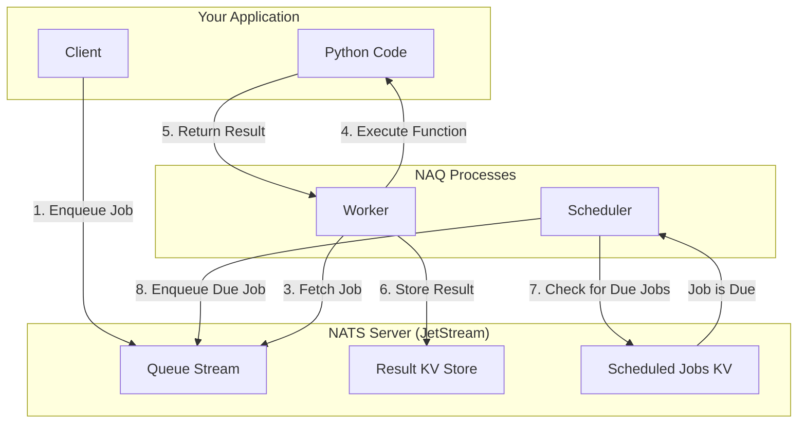

#
# Mermaid Diagram for NAQ Architecture
This diagram illustrates the interaction between the client, NAQ processes, and NATS server components
 It shows how jobs are enqueued, processed, and results stored.
 
