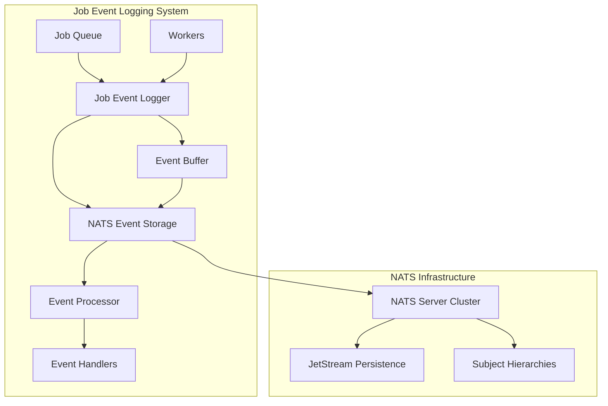

# NATS Job Event Logging Implementation Guide

## Overview

This document provides a comprehensive implementation guide for a NATS-based job event logging system, adapted from the OmniQ event logging architecture. The implementation uses "Job" instead of "Task" and "naq" instead of "omniq" in all naming conventions.

## System Architecture

### Core Design Principles

1. **Async First, Sync Wrapped**: Core functionality implemented asynchronously with synchronous wrappers providing convenience interfaces
2. **Non-blocking Logging**: Events don't slow down job execution
3. **Structured Events**: Rich metadata for monitoring and debugging
4. **Distributed by Design**: Leverage NATS for distributed event streaming and storage
5. **Real-time Processing**: Support for real-time event streaming and processing
6. **Fault Tolerance**: Handle network partitions and connection failures gracefully

### Architecture Diagram



## Data Models and Type Definitions

### JobEventType Enum

```python
class JobEventType(str, Enum):
    """Job lifecycle event types."""
    
    # Job lifecycle
    ENQUEUED = "enqueued"
    DEQUEUED = "dequeued"
    STARTED = "started"
    COMPLETED = "completed"
    FAILED = "failed"
    CANCELLED = "cancelled"
    TIMEOUT = "timeout"
    
    # Retry events
    RETRY_SCHEDULED = "retry_scheduled"
    RETRY_STARTED = "retry_started"
    MAX_RETRIES_EXCEEDED = "max_retries_exceeded"
    
    # Dependency events
    DEPENDENCY_SATISFIED = "dependency_satisfied"
    DEPENDENCY_FAILED = "dependency_failed"
    WAITING_FOR_DEPENDENCIES = "waiting_for_dependencies"
    
    # Schedule events
    SCHEDULED = "scheduled"
    SCHEDULE_TRIGGERED = "schedule_triggered"
    SCHEDULE_PAUSED = "schedule_paused"
    SCHEDULE_RESUMED = "schedule_resumed"
    SCHEDULE_DEACTIVATED = "schedule_deactivated"
    
    # Worker events
    WORKER_ASSIGNED = "worker_assigned"
    WORKER_RELEASED = "worker_released"
    
    # Queue events
    QUEUE_PRIORITY_CHANGED = "queue_priority_changed"
    QUEUE_MOVED = "queue_moved"
    
    # TTL events
    TTL_EXPIRED = "ttl_expired"
    TTL_EXTENDED = "ttl_extended"
```

### JobEvent Struct

```python
class JobEvent(msgspec.Struct):
    """Job lifecycle event for comprehensive logging and monitoring."""
    
    # Core identification
    job_id: str
    event_type: JobEventType
    timestamp: float = msgspec.field(default_factory=time.time)
    
    # Context information
    worker_id: Optional[str] = None
    worker_type: Optional[str] = None
    queue_name: Optional[str] = None
    
    # Event-specific data
    message: Optional[str] = None
    details: Dict[str, Any] = msgspec.field(default_factory=dict)
    
    # Error information (for failure events)
    error_type: Optional[str] = None
    error_message: Optional[str] = None
    
    # Performance metrics
    duration_ms: Optional[float] = None
    memory_mb: Optional[float] = None
    cpu_time_ms: Optional[float] = None
    
    # Metadata
    tags: Dict[str, str] = msgspec.field(default_factory=dict)
    metadata: Dict[str, Any] = msgspec.field(default_factory=dict)
    
    @classmethod
    def enqueued(
        cls,
        job_id: str,
        queue_name: str,
        priority: int = 0,
        **kwargs
    ) -> JobEvent:
        """Create job enqueued event."""
        return cls(
            job_id=job_id,
            event_type=JobEventType.ENQUEUED,
            queue_name=queue_name,
            message=f"Job enqueued to '{queue_name}' with priority {priority}",
            details={"priority": priority},
            **kwargs
        )
    
    @classmethod
    def started(
        cls,
        job_id: str,
        worker_id: str,
        worker_type: str,
        **kwargs
    ) -> JobEvent:
        """Create job started event."""
        return cls(
            job_id=job_id,
            event_type=JobEventType.STARTED,
            worker_id=worker_id,
            worker_type=worker_type,
            message=f"Job started on {worker_type} worker {worker_id}",
            **kwargs
        )
    
    @classmethod
    def completed(
        cls,
        job_id: str,
        worker_id: str,
        duration_ms: float,
        **kwargs
    ) -> JobEvent:
        """Create job completed event."""
        return cls(
            job_id=job_id,
            event_type=JobEventType.COMPLETED,
            worker_id=worker_id,
            duration_ms=duration_ms,
            message=f"Job completed successfully in {duration_ms:.2f}ms",
            **kwargs
        )
    
    @classmethod
    def failed(
        cls,
        job_id: str,
        worker_id: str,
        error: Exception,
        duration_ms: float,
        retry_count: int = 0,
        **kwargs
    ) -> JobEvent:
        """Create job failed event."""
        return cls(
            job_id=job_id,
            event_type=JobEventType.FAILED,
            worker_id=worker_id,
            duration_ms=duration_ms,
            error_type=type(error).__name__,
            error_message=str(error),
            message=f"Job failed after {duration_ms:.2f}ms (retry {retry_count})",
            details={"retry_count": retry_count},
            **kwargs
        )
```

## NATS Subject Structure and Message Formats

### Subject Hierarchy Design

```
naq.events.{environment}.{service}.{job_id}.{event_type}
naq.events.{environment}.all.{event_type}
naq.events.{environment}.all.*
naq.events.*.*.*.*
```

#### Subject Components:
- **naq**: Application prefix (replaces "omniq")
- **events**: Fixed component indicating event messages
- **environment**: Deployment environment (dev, staging, prod)
- **service**: Service or application name
- **job_id**: Unique job identifier
- **event_type**: Type of event (enqueued, started, completed, etc.)

### Wildcard Subscriptions for Different Use Cases

```python
# Subscribe to all events for a specific job
"naq.events.dev.myservice.job_id.*"

# Subscribe to all events of a specific type across all jobs
"naq.events.dev.*.completed"

# Subscribe to all events in an environment
"naq.events.dev.*.*"

# Subscribe to all events globally
"naq.events.*.*.*"
```

### Message Format

```json
{
  "version": "1.0",
  "job_id": "uuid-string",
  "event_type": "started",
  "timestamp": 1634567890.123,
  "worker_id": "worker-123",
  "worker_type": "async",
  "queue_name": "default",
  "message": "Job started on async worker worker-123",
  "details": {
    "priority": 0,
    "retry_count": 0
  },
  "error_type": null,
  "error_message": null,
  "duration_ms": null,
  "memory_mb": 45.2,
  "cpu_time_ms": 12.5,
  "tags": {
    "department": "engineering",
    "project": "naq"
  },
  "metadata": {
    "custom_field": "custom_value"
  }
}
```

## Storage Interface and Implementation

### BaseEventStorage Abstract Class

```python
class BaseEventStorage(ABC):
    """Abstract base interface for event storage implementations."""
    
    @abstractmethod
    async def store_event(self, event: JobEvent) -> None:
        """Store a job event."""
        pass
    
    @abstractmethod
    async def get_events(
        self,
        job_id: str,
        limit: Optional[int] = None,
        offset: int = 0
    ) -> List[JobEvent]:
        """Get events for a specific job."""
        pass
    
    @abstractmethod
    async def get_events_by_type(
        self,
        event_type: str,
        limit: Optional[int] = None,
        offset: int = 0
    ) -> List[JobEvent]:
        """Get events by type."""
        pass
    
    @abstractmethod
    async def list_events(
        self,
        limit: Optional[int] = None,
        offset: int = 0,
        filters: Optional[Dict[str, Any]] = None
    ) -> List[JobEvent]:
        """List events with optional filtering."""
        pass
    
    @abstractmethod
    async def count_events(self, filters: Optional[Dict[str, Any]] = None) -> int:
        """Count events with optional filtering."""
        pass
    
    @abstractmethod
    async def delete_events(self, job_id: str) -> int:
        """Delete all events for a job."""
        pass
    
    @abstractmethod
    async def cleanup_expired_events(self) -> int:
        """Remove expired events and return count."""
        pass
    
    @abstractmethod
    async def stream_events(
        self,
        job_id: Optional[str] = None,
        event_types: Optional[List[str]] = None
    ) -> AsyncIterator[JobEvent]:
        """Stream events in real-time."""
        pass
    
    @abstractmethod
    async def health_check(self) -> Dict[str, Any]:
        """Perform health check and return status."""
        pass
    
    async def __aenter__(self) -> BaseEventStorage:
        """Async context manager entry."""
        return self
    
    async def __aexit__(self, exc_type, exc_val, exc_tb) -> None:
        """Async context manager exit."""
        pass
```

### NATS Event Storage Implementation

```python
class NATSEventStorage(BaseEventStorage):
    """NATS-based event storage implementation using JetStream."""
    
    def __init__(
        self,
        servers: List[str],
        environment: str = "dev",
        service: str = "naq",
        stream_name: str = "naq_events",
        subject_prefix: str = "naq.events",
        max_age: int = 7 * 24 * 60 * 60,  # 7 days in seconds
        max_msgs: int = 1000000,
        max_bytes: int = 1024 * 1024 * 1024,  # 1GB
        replication: int = 1,
        **kwargs
    ):
        self.servers = servers
        self.environment = environment
        self.service = service
        self.stream_name = stream_name
        self.subject_prefix = subject_prefix
        self.max_age = max_age
        self.max_msgs = max_msgs
        self.max_bytes = max_bytes
        self.replication = replication
        self.kwargs = kwargs
        
        self._nc: Optional[NATS] = None
        self._js: Optional[JetStream] = self._js = None
        self._logger = logging.getLogger(__name__)
        self._subscription: Optional[JetStreamSubscription] = None
        self._event_stream_queue = asyncio.Queue()
        self._streaming_active = False
    
    async def _connect(self) -> None:
        """Connect to NATS and setup JetStream."""
        self._nc = await nats.connect(servers=self.servers, **self.kwargs)
        self._js = self._nc.jetstream()
        
        # Create or update JetStream stream
        try:
            await self._js.add_stream(
                name=self.stream_name,
                subjects=[f"{self.subject_prefix}.*.*.*.*"],
                max_age=self.max_age,
                max_msgs=self.max_msgs,
                max_bytes=self.max_bytes,
                replication=self.replication,
                storage=StorageType.FILE,
                retention=RetentionPolicy.LIMIT
            )
        except BadRequestError:
            # Stream already exists, update it
            await self._js.update_stream(
                name=self.stream_name,
                max_age=self.max_age,
                max_msgs=self.max_msgs,
                max_bytes=self.max_bytes,
                replication=self.replication
            )
        
        self._logger.info(f"Connected to NATS JetStream: {self.servers}")
    
    async def _disconnect(self) -> None:
        """Disconnect from NATS."""
        if self._subscription:
            await self._subscription.unsubscribe()
            self._subscription = None
        
        if self._nc:
            await self._nc.close()
            self._nc = None
            self._js = None
            self._logger.info("Disconnected from NATS")
    
    async def store_event(self, event: JobEvent) -> None:
        """Store a job event."""
        if not self._js:
            await self._connect()
        
        # Create subject
        subject = f"{self.subject_prefix}.{self.environment}.{self.service}.{event.job_id}.{event.event_type.value}"
        
        # Serialize event
        event_dict = {
            "version": "1.0",
            "job_id": event.job_id,
            "event_type": event.event_type.value,
            "timestamp": event.timestamp,
            "worker_id": event.worker_id,
            "worker_type": event.worker_type,
            "queue_name": event.queue_name,
            "message": event.message,
            "details": event.details,
            "error_type": event.error_type,
            "error_message": event.error_message,
            "duration_ms": event.duration_ms,
            "memory_mb": event.memory_mb,
            "cpu_time_ms": event.cpu_time_ms,
            "tags": event.tags,
            "metadata": event.metadata
        }
        
        # Publish to JetStream
        ack = await self._js.publish(subject, json.dumps(event_dict).encode())
        self._logger.debug(f"Stored event {event.event_type} for job {event.job_id}, seq: {ack.seq}")
        
        # Add to stream queue for real-time streaming
        if self._streaming_active:
            try:
                self._event_stream_queue.put_nowait(event)
            except asyncio.QueueFull:
                pass  # Drop events if queue is full
    
    async def get_events(
        self,
        job_id: str,
        limit: Optional[int] = None,
        offset: int = 0
    ) -> List[JobEvent]:
        """Get events for a specific job."""
        if not self._js:
            await self._connect()
        
        subject = f"{self.subject_prefix}.{self.environment}.{self.service}.{job_id}.*"
        
        # Get messages from JetStream
        events = []
        msg_count = 0
        skip_count = 0
        
        async for message in self._js.get_subject(subject):
            if skip_count < offset:
                skip_count += 1
                continue
            
            if limit is not None and msg_count >= limit:
                break
            
            event = self._message_to_event(message)
            events.append(event)
            msg_count += 1
        
        return events
    
    async def stream_events(
        self,
        job_id: Optional[str] = None,
        event_types: Optional[List[str]] = None
    ) -> AsyncIterator[JobEvent]:
        """Stream events in real-time."""
        if not self._nc:
            await self._connect()
        
        self._streaming_active = True
        
        # Create subscription subject
        if job_id:
            subject = f"{self.subject_prefix}.{self.environment}.{self.service}.{job_id}.*"
        else:
            subject = f"{self.subject_prefix}.{self.environment}.{self.service}.*.*"
        
        try:
            # Subscribe to NATS subject
            self._subscription = await self._nc.subscribe(subject)
            
            while self._streaming_active:
                try:
                    # Wait for message with timeout
                    msg = await asyncio.wait_for(self._subscription.next_msg(), timeout=1.0)
                    
                    # Parse message
                    event = self._message_to_event(msg)
                    
                    # Apply filters
                    if event_types and event.event_type.value not in event_types:
                        continue
                    
                    yield event
                    
                except asyncio.TimeoutError:
                    # Check if we should continue streaming
                    continue
                except Exception as e:
                    self._logger.error(f"Error processing streamed message: {e}")
                    continue
                    
        finally:
            self._streaming_active = False
            if self._subscription:
                await self._subscription.unsubscribe()
                self._subscription = None
    
    def _message_to_event(self, message: Msg) -> JobEvent:
        """Convert NATS message to JobEvent object."""
        try:
            data = json.loads(message.data.decode())
            
            return JobEvent(
                job_id=data["job_id"],
                event_type=JobEventType(data["event_type"]),
                timestamp=data["timestamp"],
                worker_id=data.get("worker_id"),
                worker_type=data.get("worker_type"),
                queue_name=data.get("queue_name"),
                message=data.get("message"),
                details=data.get("details", {}),
                error_type=data.get("error_type"),
                error_message=data.get("error_message"),
                duration_ms=data.get("duration_ms"),
                memory_mb=data.get("memory_mb"),
                cpu_time_ms=data.get("cpu_time_ms"),
                tags=data.get("tags", {}),
                metadata=data.get("metadata", {})
            )
        except Exception as e:
            self._logger.error(f"Error parsing message: {e}")
            raise
    
    async def health_check(self) -> Dict[str, Any]:
        """Perform health check and return status."""
        if not self._nc or not self._js:
            return {"status": "disconnected"}
        
        try:
            # Test NATS connection
            await self._nc.request("$SYS.REQ.SERVER.PING", b"")
            
            # Get JetStream stream info
            stream_info = await self._js.stream_info(self.stream_name)
            
            return {
                "status": "healthy",
                "servers": self.servers,
                "stream_name": self.stream_name,
                "subject_prefix": self.subject_prefix,
                "stream_state": {
                    "messages": stream_info.state.messages,
                    "bytes": stream_info.state.bytes,
                    "first_seq": stream_info.state.first_seq,
                    "last_seq": stream_info.state.last_seq,
                    "consumer_count": stream_info.state.consumer_count
                },
                "streaming_active": self._streaming_active
            }
            
        except Exception as e:
            return {
                "status": "error",
                "error": str(e)
            }
    
    # Implement other required methods (get_events_by_type, list_events, etc.)
    # following similar patterns
```

## Event Logger and Processor Components

### AsyncJobEventLogger Class

```python
class AsyncJobEventLogger:
    """Async job event logger with NATS storage and batch processing."""
    
    def __init__(
        self,
        storage: BaseEventStorage,
        batch_size: int = 100,
        flush_interval: float = 5.0,
        max_buffer_size: int = 10000,
        retry_attempts: int = 3,
        retry_delay: float = 1.0
    ):
        self.storage = storage
        self.batch_size = batch_size
        self.flush_interval = flush_interval
        self.max_buffer_size = max_buffer_size
        self.retry_attempts = retry_attempts
        self.retry_delay = retry_delay
        
        self._buffer: List[JobEvent] = []
        self._flush_task: Optional[asyncio.Task] = None
        self._flush_lock = asyncio.Lock()
        self._logger = logging.getLogger(__name__)
        self._closed = False
    
    async def __aenter__(self) -> AsyncJobEventLogger:
        """Async context manager entry."""
        await self.start()
        return self
    
    async def __aexit__(self, exc_type, exc_val, exc_tb) -> None:
        """Async context manager exit."""
        await self.stop()
    
    async def start(self) -> None:
        """Start the event logger."""
        self._flush_task = asyncio.create_task(self._flush_loop())
        self._logger.info("Job event logger started")
    
    async def stop(self) -> None:
        """Stop the event logger and flush remaining events."""
        self._closed = True
        
        if self._flush_task:
            # Cancel the flush task
            self._flush_task.cancel()
            try:
                await self._flush_task
            except asyncio.CancelledError:
                pass
        
        # Flush remaining events
        await self._flush_events(force=True)
        self._logger.info("Job event logger stopped")
    
    async def log_event(self, event: JobEvent) -> None:
        """Log a job event."""
        if self._closed:
            raise RuntimeError("Event logger is closed")
        
        # Add to buffer
        self._buffer.append(event)
        
        # Check if buffer is full
        if len(self._buffer) >= self.batch_size:
            asyncio.create_task(self._flush_events())
        
        # Check if buffer exceeds max size
        if len(self._buffer) >= self.max_buffer_size:
            self._logger.warning(f"Event buffer full ({len(self._buffer)} events), dropping oldest events")
            self._buffer = self._buffer[-self.max_buffer_size:]
    
    async def log_job_enqueued(
        self,
        job_id: str,
        queue_name: str,
        priority: int = 0,
        **kwargs
    ) -> None:
        """Log job enqueued event."""
        event = JobEvent.enqueued(
            job_id=job_id,
            queue_name=queue_name,
            priority=priority,
            **kwargs
        )
        await self.log_event(event)
    
    async def log_job_started(
        self,
        job_id: str,
        worker_id: str,
        worker_type: str,
        **kwargs
    ) -> None:
        """Log job started event."""
        event = JobEvent.started(
            job_id=job_id,
            worker_id=worker_id,
            worker_type=worker_type,
            **kwargs
        )
        await self.log_event(event)
    
    async def log_job_completed(
        self,
        job_id: str,
        worker_id: str,
        duration_ms: float,
        **kwargs
    ) -> None:
        """Log job completed event."""
        event = JobEvent.completed(
            job_id=job_id,
            worker_id=worker_id,
            duration_ms=duration_ms,
            **kwargs
        )
        await self.log_event(event)
    
    async def log_job_failed(
        self,
        job_id: str,
        worker_id: str,
        error: Exception,
        duration_ms: float,
        retry_count: int = 0,
        **kwargs
    ) -> None:
        """Log job failed event."""
        event = JobEvent.failed(
            job_id=job_id,
            worker_id=worker_id,
            error=error,
            duration_ms=duration_ms,
            retry_count=retry_count,
            **kwargs
        )
        await self.log_event(event)
    
    async def _flush_loop(self) -> None:
        """Background flush task."""
        while not self._closed:
            try:
                # Wait for flush interval or cancellation
                await asyncio.sleep(self.flush_interval)
                
                # Flush events
                await self._flush_events()
                
            except asyncio.CancelledError:
                break
            except Exception as e:
                self._logger.error(f"Error in flush loop: {e}")
                await asyncio.sleep(self.retry_delay)
    
    async def _flush_events(self, force: bool = False) -> None:
        """Flush buffered events to storage."""
        async with self._flush_lock:
            if not self._buffer:
                return
            
            # Take a copy of the buffer
            events_to_flush = self._buffer.copy()
            
            # Clear buffer only if forced or batch size reached
            if force or len(events_to_flush) >= self.batch_size:
                self._buffer.clear()
            else:
                return
            
            # Store events with retry logic
            for attempt in range(self.retry_attempts):
                try:
                    # Store events in batches
                    for i in range(0, len(events_to_flush), self.batch_size):
                        batch = events_to_flush[i:i + self.batch_size]
                        
                        # Store each event individually
                        for event in batch:
                            await self.storage.store_event(event)
                    
                    self._logger.debug(f"Flushed {len(events_to_flush)} events")
                    break
                    
                except Exception as e:
                    self._logger.error(f"Error flushing events (attempt {attempt + 1}): {e}")
                    
                    if attempt < self.retry_attempts - 1:
                        await asyncio.sleep(self.retry_delay * (2 ** attempt))  # Exponential backoff
                    else:
                        # Re-add failed events to buffer for retry
                        self._buffer.extend(events_to_flush)
                        self._logger.error("Failed to flush events after maximum retries")
```

### JobEventProcessor Class

```python
class AsyncJobEventProcessor:
    """Real-time job event processing with handler management."""
    
    def __init__(
        self,
        storage: BaseEventStorage,
        max_concurrent_handlers: int = 10,
        handler_timeout: float = 30.0
    ):
        self.storage = storage
        self.max_concurrent_handlers = max_concurrent_handlers
        self.handler_timeout = handler_timeout
        
        self._handlers: Dict[JobEventType, List[Callable[[JobEvent], Awaitable[None]]]] = {}
        self._global_handlers: List[Callable[[JobEvent], Awaitable[None]]] = []
        self._processing_task: Optional[asyncio.Task] = None
        self._semaphore = asyncio.Semaphore(max_concurrent_handlers)
        self._logger = logging.getLogger(__name__)
        self._closed = False
    
    async def __aenter__(self) -> AsyncJobEventProcessor:
        """Async context manager entry."""
        await self.start()
        return self
    
    async def __aexit__(self, exc_type, exc_val, exc_tb) -> None:
        """Async context manager exit."""
        await self.stop()
    
    async def start(self) -> None:
        """Start the event processor."""
        self._processing_task = asyncio.create_task(self._process_events())
        self._logger.info("Job event processor started")
    
    async def stop(self) -> None:
        """Stop the event processor."""
        self._closed = True
        
        if self._processing_task:
            self._processing_task.cancel()
            try:
                await self._processing_task
            except asyncio.CancelledError:
                pass
        
        self._logger.info("Job event processor stopped")
    
    def add_handler(
        self,
        event_type: JobEventType,
        handler: Callable[[JobEvent], Awaitable[None]]
    ) -> None:
        """Add handler for specific event type."""
        if event_type not in self._handlers:
            self._handlers[event_type] = []
        self._handlers[event_type].append(handler)
        self._logger.debug(f"Added handler for {event_type} events")
    
    def add_global_handler(
        self,
        handler: Callable[[JobEvent], Awaitable[None]]
    ) -> None:
        """Add global handler for all events."""
        self._global_handlers.append(handler)
        self._logger.debug("Added global event handler")
    
    def remove_handler(
        self,
        event_type: JobEventType,
        handler: Callable[[JobEvent], Awaitable[None]]
    ) -> None:
        """Remove handler for specific event type."""
        if event_type in self._handlers:
            try:
                self._handlers[event_type].remove(handler)
                self._logger.debug(f"Removed handler for {event_type} events")
            except ValueError:
                pass
    
    def remove_global_handler(
        self,
        handler: Callable[[JobEvent], Awaitable[None]]
    ) -> None:
        """Remove global handler."""
        try:
            self._global_handlers.remove(handler)
            self._logger.debug("Removed global event handler")
        except ValueError:
            pass
    
    async def process_event(self, event: JobEvent) -> None:
        """Process a single event through all registered handlers."""
        async with self._semaphore:
            try:
                # Get handlers for this event type
                handlers = self._handlers.get(event.event_type, [])
                
                # Add global handlers
                all_handlers = handlers + self._global_handlers
                
                if not all_handlers:
                    return
                
                # Execute handlers with timeout
                tasks = []
                for handler in all_handlers:
                    task = asyncio.wait_for(
                        handler(event),
                        timeout=self.handler_timeout
                    )
                    tasks.append(task)
                
                # Run handlers concurrently
                results = await asyncio.gather(*tasks, return_exceptions=True)
                
                # Log any exceptions
                for handler, result in zip(all_handlers, results):
                    if isinstance(result, Exception):
                        self._logger.error(f"Handler {handler.__name__} failed: {result}")
                
            except asyncio.TimeoutError:
                self._logger.error(f"Handler timeout for event {event.event_type}")
            except Exception as e:
                self._logger.error(f"Error processing event {event.event_type}: {e}")
    
    async def monitor_job(
        self,
        job_id: str,
        callback: Callable[[JobEvent], Awaitable[None]]
    ) -> None:
        """Monitor events for a specific job."""
        async for event in self.storage.stream_events(job_id=job_id):
            await callback(event)
    
    async def wait_for_event(
        self,
        job_id: str,
        event_type: JobEventType,
        timeout: Optional[float] = None
    ) -> Optional[JobEvent]:
        """Wait for specific event occurrence."""
        start_time = asyncio.get_event_loop().time()
        
        async for event in self.storage.stream_events(job_id=job_id, event_types=[event_type.value]):
            return event
        
        if timeout is not None:
            elapsed = asyncio.get_event_loop().time() - start_time
            if elapsed >= timeout:
                return None
        
        return None
    
    async def _process_events(self) -> None:
        """Background event processing loop."""
        try:
            # Stream events from storage
            async for event in self.storage.stream_events():
                if self._closed:
                    break
                
                # Process the event
                await self.process_event(event)
                
        except asyncio.CancelledError:
            pass
        except Exception as e:
            self._logger.error(f"Error in event processing loop: {e}")
```

## Architecture Patterns and Implementation Considerations

### 1. Async First, Sync Wrapped Pattern

```python
class JobEventLogger:
    """Synchronous wrapper around AsyncJobEventLogger."""
    
    def __init__(self, storage: BaseEventStorage, **kwargs):
        self._async_logger = AsyncJobEventLogger(storage, **kwargs)
        self._loop = asyncio.get_event_loop()
    
    def __enter__(self) -> JobEventLogger:
        """Sync context manager entry."""
        anyio.from_thread.run(self._async_logger.start)
        return self
    
    def __exit__(self, exc_type, exc_val, exc_tb) -> None:
        """Sync context manager exit."""
        anyio.from_thread.run(self._async_logger.stop)
    
    def log_event(self, event: JobEvent) -> None:
        """Log a job event."""
        anyio.from_thread.run(self._async_logger.log_event, event)
    
    def log_job_enqueued(self, job_id: str, queue_name: str, priority: int = 0, **kwargs) -> None:
        """Log job enqueued event."""
        anyio.from_thread.run(self._async_logger.log_job_enqueued, job_id, queue_name, priority, **kwargs)
    
    # Similar wrapper methods for other logging operations
```

### 2. NATS-Specific Optimization Strategies

#### Connection Management
- **Connection Pooling**: Maintain a pool of NATS connections for high-throughput scenarios
- **Reconnection Logic**: Implement automatic reconnection with exponential backoff
- **Load Balancing**: Distribute connections across multiple NATS servers

#### Message Persistence with JetStream
- **Stream Configuration**: Configure streams with appropriate retention policies
- **Consumer Management**: Use durable consumers for reliable event processing
- **Acknowledgment Handling**: Implement proper ACK/NACK handling for message processing

#### Subject-Based Routing
- **Hierarchical Subjects**: Use structured subject hierarchies for efficient routing
- **Wildcard Subscriptions**: Leverage wildcards for flexible event consumption
- **Subject Filtering**: Implement client-side filtering for additional granularity

### 3. Fault Tolerance and Error Handling

#### Network Resilience
- **Retry Logic**: Implement exponential backoff for failed operations
- **Circuit Breakers**: Prevent cascade failures during NATS outages
- **Local Buffering**: Buffer events locally during network interruptions

#### Message Ordering and Deduplication
- **Sequence Numbers**: Use JetStream sequence numbers for ordering
- **Message IDs**: Implement unique message IDs for deduplication
- **Idempotent Handlers**: Design handlers to be idempotent

### 4. Performance Considerations

#### Batch Processing
- **Adaptive Batching**: Adjust batch sizes based on system load
- **Flush Strategies**: Implement time-based and size-based flushing
- **Memory Management**: Monitor and limit memory usage for event buffers

#### Concurrency Control
- **Semaphore Limits**: Control concurrent handler execution
- **Timeout Management**: Implement timeouts for long-running handlers
- **Resource Monitoring**: Track CPU, memory, and network usage

## Implementation Guidelines and Best Practices

### 1. NATS Configuration

```python
# Recommended NATS configuration for production
NATS_CONFIG = {
    "servers": ["nats://localhost:4222"],
    "max_reconnect_attempts": 10,
    "reconnect_time_wait": 2,
    "max_payload": 1048576,  # 1MB
    "connect_timeout": 5,
    "ping_interval": 120,
    "max_outstanding_pings": 2,
    "dont_randomize": False,
    "flush_timeout": 10,
    "tls": {
        "cert_chain": "/path/to/cert.pem",
        "private_key": "/path/to/key.pem",
        "ca_path": "/path/to/ca.pem"
    }
}

# JetStream stream configuration
STREAM_CONFIG = {
    "name": "naq_events",
    "subjects": ["naq.events.*.*.*.*"],
    "max_age": 7 * 24 * 60 * 60,  # 7 days
    "max_msgs": 1000000,
    "max_bytes": 1024 * 1024 * 1024,  # 1GB
    "replication": 3,  # For production cluster
    "retention": "limit",
    "storage": "file",
    "duplicates": 120  # 2 minutes window
}
```

### 2. Event Handler Best Practices

```python
async def job_completion_handler(event: JobEvent) -> None:
    """Example handler for job completion events."""
    try:
        # Extract relevant information
        job_id = event.job_id
        duration = event.duration_ms
        worker_id = event.worker_id
        
        # Process the event
        await update_job_metrics(job_id, duration, worker_id)
        
        # Trigger follow-up actions
        if event.metadata.get("notify_on_completion"):
            await send_completion_notification(job_id)
            
    except Exception as e:
        # Log handler errors but don't raise
        logger.error(f"Job completion handler failed: {e}")
        # Optionally implement retry logic or dead-letter queue
```

### 3. Monitoring and Observability

#### Key Metrics to Track
- **Event Throughput**: Number of events processed per second
- **Event Latency**: Time from event creation to processing
- **Handler Execution Time**: Time spent in event handlers
- **Error Rates**: Percentage of failed events and handler errors
- **Buffer Sizes**: Current size of event buffers
- **NATS Connection Status**: Health of NATS connections

#### Structured Logging Example
```python
import structlog

logger = structlog.get_logger("naq.events")

# In event processing
logger.info(
    "event_processed",
    event_type=event.event_type.value,
    job_id=event.job_id,
    duration_ms=event.duration_ms,
    handler_count=len(handlers),
    processing_time_ms=processing_time
)
```

### 4. Testing Strategy

#### Unit Testing
```python
import pytest
from unittest.mock import AsyncMock, MagicMock

@pytest.mark.asyncio
async def test_event_logger_flush():
    """Test event logger flushing behavior."""
    # Mock storage
    storage = AsyncMock()
    storage.store_event = AsyncMock()
    
    # Create logger
    logger = AsyncJobEventLogger(storage, batch_size=2)
    
    # Log events
    await logger.log_event(JobEvent.enqueued("job1", "queue1"))
    await logger.log_event(JobEvent.enqueued("job2", "queue1"))
    
    # Verify flush was called
    assert storage.store_event.call_count == 2
```

#### Integration Testing
```python
@pytest.mark.asyncio
async def test_nats_event_storage_integration():
    """Test NATS event storage with real NATS server."""
    # Use testcontainers or a local NATS server
    storage = NATSEventStorage(
        servers=["nats://localhost:4222"],
        environment="test",
        service="test_service"
    )
    
    async with storage:
        # Store event
        event = JobEvent.enqueued("test_job", "test_queue")
        await storage.store_event(event)
        
        # Retrieve event
        events = await storage.get_events("test_job")
        assert len(events) == 1
        assert events[0].job_id == "test_job"
```

### 5. Deployment Considerations

#### Scaling Strategies
- **Horizontal Scaling**: Deploy multiple event processor instances
- **Consumer Groups**: Use NATS queue groups for load balancing
- **Stream Replication**: Configure JetStream replication for high availability

#### Resource Management
- **Memory Limits**: Set appropriate memory limits for event buffers
- **Connection Limits**: Monitor and limit NATS connections
- **CPU Allocation**: Allocate sufficient CPU for event processing

#### Security Considerations
- **Authentication**: Configure NATS authentication and authorization
- **Encryption**: Use TLS for NATS connections
- **Message Validation**: Validate event messages before processing

## Conclusion

This NATS-based job event logging implementation provides a robust, scalable, and fault-tolerant system for tracking job lifecycle events in distributed environments. By leveraging NATS JetStream for persistence and streaming, the system ensures reliable event delivery and real-time processing capabilities.

The implementation follows the "Async First, Sync Wrapped" pattern, providing both high-performance async interfaces and convenient sync wrappers. The modular design allows for easy extension and customization to meet specific requirements.

Key benefits of this implementation include:
- **Distributed by Design**: Leverages NATS for distributed event streaming
- **Fault Tolerant**: Handles network partitions and connection failures gracefully
- **High Performance**: Batch processing and async execution minimize overhead
- **Observable**: Comprehensive metrics and logging for monitoring
- **Scalable**: Horizontal scaling with consumer groups and stream replication

This implementation can serve as a foundation for building sophisticated event-driven systems and can be easily integrated into existing job queue libraries or distributed processing frameworks.