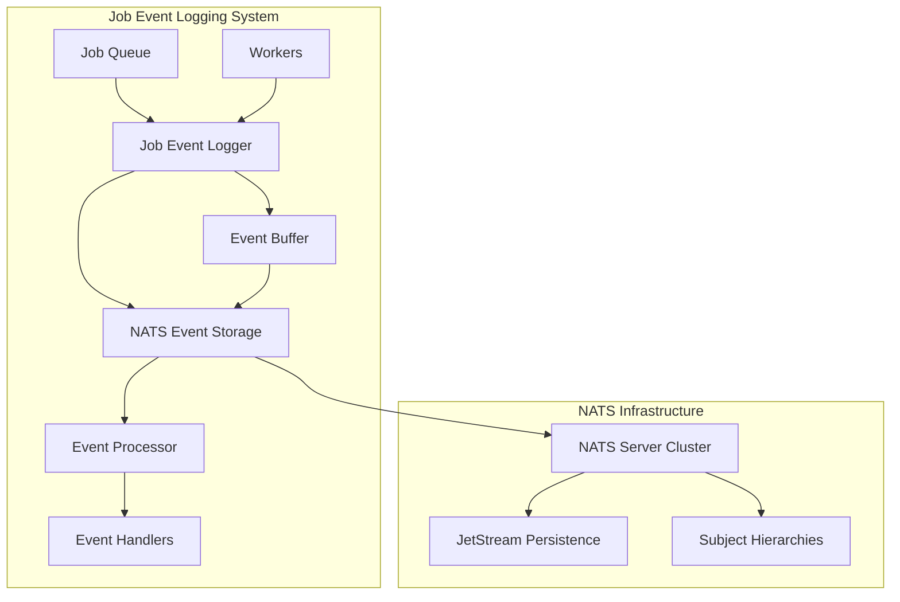

# NATS Job Event Logging Implementation Guide

## Table of Contents
1. [Overview & System Architecture](#overview--system-architecture)
2. [Data Models and Type Definitions](#data-models-and-type-definitions)
3. [NATS Subject Structure and Message Formats](#nats-subject-structure-and-message-formats)
4. [Storage Interface and Implementation](#storage-interface-and-implementation)
5. [Event Logger and Processor Components](#event-logger-and-processor-components)
6. [Configuration and Setup](#configuration-and-setup)
7. [Performance Optimization](#performance-optimization)
8. [Implementation Examples](#implementation-examples)
9. [Testing and Monitoring](#testing-and-monitoring)
10. [Deployment Considerations](#deployment-considerations)
11. [Conclusion](#conclusion)

## Overview & System Architecture

This document provides a comprehensive implementation guide for a NATS-based job event logging system, adapted from the OmniQ event logging architecture. The implementation uses "Job" instead of "Task" and "naq" instead of "omniq" in all naming conventions.

### Why NATS for Job Event Logging?

1. **Native Streaming**: JetStream provides durable, ordered message streaming
2. **Subject-based Routing**: Natural filtering by job ID, event type, worker, queue
3. **Real-time Pub/Sub**: Immediate event delivery to interested consumers
4. **Horizontal Scaling**: Multi-server clusters with automatic failover
5. **Message Ordering**: Guarantees event ordering within job streams
6. **Persistence Options**: Memory, file, and replicated storage
7. **Consumer Groups**: Load balancing and fault tolerance

### Core Design Principles

1. **Async First, Sync Wrapped**: Core functionality implemented asynchronously with synchronous wrappers providing convenience interfaces
2. **Non-blocking Logging**: Events don't slow down job execution
3. **Structured Events**: Rich metadata for monitoring and debugging
4. **Distributed by Design**: Leverage NATS for distributed event streaming and storage
5. **Real-time Processing**: Support for real-time event streaming and processing
6. **Fault Tolerance**: Handle network partitions and connection failures gracefully

### Architecture Diagram



### Architecture Comparison: SQLite vs NATS

| Feature | SQLite | NATS JetStream |
|---------|--------|----------------|
| **Scalability** | Single process | Distributed cluster |
| **Real-time** | Polling required | Native pub/sub |
| **Persistence** | File/Memory | File/Memory/Replicated |
| **Ordering** | Query-based | Stream-guaranteed |
| **Filtering** | SQL WHERE | Subject wildcards |
| **Streaming** | Application-level | Built-in streaming |
| **Fault Tolerance** | Single point of failure | Multi-node redundancy |

## Data Models and Type Definitions

### JobEventType Enum

```python
class JobEventType(str, Enum):
    """Job lifecycle event types."""
    
    # Job lifecycle
    ENQUEUED = "enqueued"
    DEQUEUED = "dequeued"
    STARTED = "started"
    COMPLETED = "completed"
    FAILED = "failed"
    CANCELLED = "cancelled"
    TIMEOUT = "timeout"
    
    # Retry events
    RETRY_SCHEDULED = "retry_scheduled"
    RETRY_STARTED = "retry_started"
    MAX_RETRIES_EXCEEDED = "max_retries_exceeded"
    
    # Dependency events
    DEPENDENCY_SATISFIED = "dependency_satisfied"
    DEPENDENCY_FAILED = "dependency_failed"
    WAITING_FOR_DEPENDENCIES = "waiting_for_dependencies"
    
    # Schedule events
    SCHEDULED = "scheduled"
    SCHEDULE_TRIGGERED = "schedule_triggered"
    SCHEDULE_PAUSED = "schedule_paused"
    SCHEDULE_RESUMED = "schedule_resumed"
    SCHEDULE_DEACTIVATED = "schedule_deactivated"
    
    # Worker events
    WORKER_ASSIGNED = "worker_assigned"
    WORKER_RELEASED = "worker_released"
    
    # Queue events
    QUEUE_PRIORITY_CHANGED = "queue_priority_changed"
    QUEUE_MOVED = "queue_moved"
    
    # TTL events
    TTL_EXPIRED = "ttl_expired"
    TTL_EXTENDED = "ttl_extended"
```

### JobEvent Struct

```python
class JobEvent(msgspec.Struct):
    """Job lifecycle event for comprehensive logging and monitoring."""
    
    # Core identification
    job_id: str
    event_type: JobEventType
    timestamp: float = msgspec.field(default_factory=time.time)
    
    # Context information
    worker_id: Optional[str] = None
    worker_type: Optional[str] = None
    queue_name: Optional[str] = None
    
    # Event-specific data
    message: Optional[str] = None
    details: Dict[str, Any] = msgspec.field(default_factory=dict)
    
    # Error information (for failure events)
    error_type: Optional[str] = None
    error_message: Optional[str] = None
    
    # Performance metrics
    duration_ms: Optional[float] = None
    memory_mb: Optional[float] = None
    cpu_time_ms: Optional[float] = None
    
    # Metadata
    tags: Dict[str, str] = msgspec.field(default_factory=dict)
    metadata: Dict[str, Any] = msgspec.field(default_factory=dict)
    
    # NATS-specific fields
    nats_subject: Optional[str] = None
    nats_sequence: Optional[int] = None
    
    @classmethod
    def enqueued(
        cls,
        job_id: str,
        queue_name: str,
        priority: int = 0,
        **kwargs
    ) -> JobEvent:
        """Create job enqueued event."""
        return cls(
            job_id=job_id,
            event_type=JobEventType.ENQUEUED,
            queue_name=queue_name,
            message=f"Job enqueued to '{queue_name}' with priority {priority}",
            details={"priority": priority},
            **kwargs
        )
    
    @classmethod
    def started(
        cls,
        job_id: str,
        worker_id: str,
        worker_type: str,
        **kwargs
    ) -> JobEvent:
        """Create job started event."""
        return cls(
            job_id=job_id,
            event_type=JobEventType.STARTED,
            worker_id=worker_id,
            worker_type=worker_type,
            message=f"Job started on {worker_type} worker {worker_id}",
            **kwargs
        )
    
    @classmethod
    def completed(
        cls,
        job_id: str,
        worker_id: str,
        duration_ms: float,
        **kwargs
    ) -> JobEvent:
        """Create job completed event."""
        return cls(
            job_id=job_id,
            event_type=JobEventType.COMPLETED,
            worker_id=worker_id,
            duration_ms=duration_ms,
            message=f"Job completed successfully in {duration_ms:.2f}ms",
            **kwargs
        )
    
    @classmethod
    def failed(
        cls,
        job_id: str,
        worker_id: str,
        error: Exception,
        duration_ms: float,
        retry_count: int = 0,
        **kwargs
    ) -> JobEvent:
        """Create job failed event."""
        return cls(
            job_id=job_id,
            event_type=JobEventType.FAILED,
            worker_id=worker_id,
            duration_ms=duration_ms,
            error_type=type(error).__name__,
            error_message=str(error),
            message=f"Job failed after {duration_ms:.2f}ms (retry {retry_count})",
            details={"retry_count": retry_count},
            **kwargs
        )
    
    def to_nats_subject(self) -> str:
        """Generate NATS subject for this event."""
        base = f"naq.jobs.events.{self.job_id}"
        
        if self.worker_id:
            return f"{base}.worker.{self.worker_id}.{self.event_type.value}"
        elif self.queue_name:
            return f"{base}.queue.{self.queue_name}.{self.event_type.value}"
        else:
            return f"{base}.{self.event_type.value}"
```

## NATS Subject Structure and Message Formats

### Subject Hierarchy Design

```
naq.jobs.events.{job_id}.{event_type}                    # Basic job event
naq.jobs.events.{job_id}.lifecycle.{event_type}          # Lifecycle events
naq.jobs.events.{job_id}.worker.{worker_id}.{event_type} # Worker-specific events
naq.jobs.events.{job_id}.queue.{queue_name}.{event_type} # Queue-specific events
naq.jobs.events.{job_id}.retry.{retry_count}.{event_type} # Retry events
naq.jobs.events.{job_id}.schedule.{schedule_name}.{event_type} # Schedule events

# Global event aggregation
naq.jobs.events.global.{event_type}                      # All events of type
naq.jobs.events.global.worker.{worker_id}.{event_type}   # Worker aggregation
naq.jobs.events.global.queue.{queue_name}.{event_type}   # Queue aggregation
```

#### Subject Components:
- **naq**: Application prefix (replaces "omniq")
- **jobs**: Fixed component indicating job-related messages
- **events**: Fixed component indicating event messages
- **job_id**: Unique job identifier
- **event_type**: Type of event (enqueued, started, completed, etc.)
- **worker_id**: Worker identifier (for worker-specific events)
- **queue_name**: Queue name (for queue-specific events)
- **global**: Special identifier for aggregated events

### Subject Examples

```
# Job lifecycle events
naq.jobs.events.job-123.enqueued
naq.jobs.events.job-123.started
naq.jobs.events.job-123.completed
naq.jobs.events.job-123.failed

# Worker-specific events
naq.jobs.events.job-123.worker.worker-456.assigned
naq.jobs.events.job-123.worker.worker-456.started
naq.jobs.events.job-123.worker.worker-456.released

# Queue-specific events
naq.jobs.events.job-123.queue.high-priority.enqueued
naq.jobs.events.job-123.queue.high-priority.dequeued

# Global aggregation
naq.jobs.events.global.failed                  # All job failures
naq.jobs.events.global.worker.worker-456.>     # All events from worker-456
naq.jobs.events.global.queue.high-priority.>   # All high-priority queue events
```

### Wildcard Subscriptions for Different Use Cases

```python
# Subscribe to all events for a specific job
"naq.jobs.events.job-123.>"

# Subscribe to all events of a specific type across all jobs
"naq.jobs.events.*.failed"

# Subscribe to all worker events
"naq.jobs.events.*.worker.*.>"

# Subscribe to specific queue events
"naq.jobs.events.*.queue.high-priority.>"

# Subscribe to all events (monitoring)
"naq.jobs.events.>"
```

### Message Format

```json
{
  "version": "1.0",
  "job_id": "uuid-string",
  "event_type": "started",
  "timestamp": 1634567890.123,
  "worker_id": "worker-123",
  "worker_type": "async",
  "queue_name": "default",
  "message": "Job started on async worker worker-123",
  "details": {
    "priority": 0,
    "retry_count": 0
  },
  "error_type": null,
  "error_message": null,
  "duration_ms": null,
  "memory_mb": 45.2,
  "cpu_time_ms": 12.5,
  "tags": {
    "department": "engineering",
    "project": "naq"
  },
  "metadata": {
    "custom_field": "custom_value"
  },
  "nats_subject": "naq.jobs.events.job-123.worker.worker-123.started",
  "nats_sequence": 12345
}
```

## Storage Interface and Implementation

### BaseEventStorage Abstract Class

```python
class BaseEventStorage(ABC):
    """Abstract base interface for event storage implementations."""
    
    @abstractmethod
    async def store_event(self, event: JobEvent) -> None:
        """Store a job event."""
        pass
    
    @abstractmethod
    async def get_events(
        self,
        job_id: str,
        limit: Optional[int] = None,
        offset: int = 0
    ) -> List[JobEvent]:
        """Get events for a specific job."""
        pass
    
    @abstractmethod
    async def get_events_by_type(
        self,
        event_type: str,
        limit: Optional[int] = None,
        offset: int = 0
    ) -> List[JobEvent]:
        """Get events by type."""
        pass
    
    @abstractmethod
    async def list_events(
        self,
        limit: Optional[int] = None,
        offset: int = 0,
        filters: Optional[Dict[str, Any]] = None
    ) -> List[JobEvent]:
        """List events with optional filtering."""
        pass
    
    @abstractmethod
    async def count_events(self, filters: Optional[Dict[str, Any]] = None) -> int:
        """Count events with optional filtering."""
        pass
    
    @abstractmethod
    async def delete_events(self, job_id: str) -> int:
        """Delete all events for a job."""
        pass
    
    @abstractmethod
    async def cleanup_expired_events(self) -> int:
        """Remove expired events and return count."""
        pass
    
    @abstractmethod
    async def stream_events(
        self,
        job_id: Optional[str] = None,
        event_types: Optional[List[str]] = None
    ) -> AsyncIterator[JobEvent]:
        """Stream events in real-time."""
        pass
    
    @abstractmethod
    async def health_check(self) -> Dict[str, Any]:
        """Perform health check and return status."""
        pass
    
    async def __aenter__(self) -> BaseEventStorage:
        """Async context manager entry."""
        return self
    
    async def __aexit__(self, exc_type, exc_val, exc_tb) -> None:
        """Async context manager exit."""
        pass
```

### NATS Event Storage Implementation

```python
class NATSEventStorage(BaseEventStorage):
    """NATS-based event storage implementation using JetStream."""
    
    def __init__(
        self,
        servers: List[str],
        environment: str = "dev",
        service: str = "naq",
        stream_name: str = "naq_events",
        subject_prefix: str = "naq.jobs.events",
        max_age: int = 7 * 24 * 60 * 60,  # 7 days in seconds
        max_msgs: int = 1000000,
        max_bytes: int = 1024 * 1024 * 1024,  # 1GB
        replication: int = 1,
        **kwargs
    ):
        self.servers = servers
        self.environment = environment
        self.service = service
        self.stream_name = stream_name
        self.subject_prefix = subject_prefix
        self.max_age = max_age
        self.max_msgs = max_msgs
        self.max_bytes = max_bytes
        self.replication = replication
        self.kwargs = kwargs
        
        self._nc: Optional[NATS] = None
        self._js: Optional[JetStream] = None
        self._logger = logging.getLogger(__name__)
        self._subscription: Optional[JetStreamSubscription] = None
        self._event_stream_queue = asyncio.Queue()
        self._streaming_active = False
        
        # Consumer tracking for cleanup
        self._consumers: List[str] = []
        self._subscriptions: List[nats.js.JetStreamSubscription] = []
    
    async def _connect(self) -> None:
        """Connect to NATS and setup JetStream."""
        self._nc = await nats.connect(servers=self.servers, **self.kwargs)
        self._js = self._nc.jetstream()
        
        # Create or update JetStream stream
        try:
            await self._js.add_stream(
                name=self.stream_name,
                subjects=[f"{self.subject_prefix}.>"],
                max_age=self.max_age,
                max_msgs=self.max_msgs,
                max_bytes=self.max_bytes,
                replication=self.replication,
                storage=StorageType.FILE,
                retention=RetentionPolicy.LIMIT
            )
        except BadRequestError:
            # Stream already exists, update it
            await self._js.update_stream(
                name=self.stream_name,
                max_age=self.max_age,
                max_msgs=self.max_msgs,
                max_bytes=self.max_bytes,
                replication=self.replication
            )
        
        self._logger.info(f"Connected to NATS JetStream: {self.servers}")
    
    async def _disconnect(self) -> None:
        """Disconnect from NATS."""
        if self._subscription:
            await self._subscription.unsubscribe()
            self._subscription = None
        
        # Clean up subscriptions
        for subscription in self._subscriptions:
            try:
                await subscription.unsubscribe()
            except:
                pass
        self._subscriptions.clear()
        
        if self._nc:
            await self._nc.close()
            self._nc = None
            self._js = None
            self._logger.info("Disconnected from NATS")
    
    async def store_event(self, event: JobEvent) -> None:
        """Store a job event."""
        if not self._js:
            await self._connect()
        
        # Generate subject for the event
        subject = self._generate_subject(event)
        
        # Serialize event
        data = msgspec.msgpack.encode(event)
        
        # Add NATS metadata to event
        event.nats_subject = subject
        
        try:
            # Publish to JetStream
            ack = await self._js.publish(subject, data)
            event.nats_sequence = ack.seq
            
            self._logger.debug(f"Stored event {event.event_type} for job {event.job_id}, seq: {ack.seq}")
            
        except Exception as e:
            self._logger.error(f"Failed to store event: {e}")
            raise
    
    def _generate_subject(self, event: JobEvent) -> str:
        """Generate NATS subject for event."""
        base = f"{self.subject_prefix}.{event.job_id}"
        
        # Add context-specific routing
        if event.worker_id:
            return f"{base}.worker.{event.worker_id}.{event.event_type.value}"
        elif event.queue_name:
            return f"{base}.queue.{event.queue_name}.{event.event_type.value}"
        else:
            return f"{base}.{event.event_type.value}"
    
    async def get_events(
        self,
        job_id: str,
        limit: Optional[int] = None,
        offset: int = 0
    ) -> List[JobEvent]:
        """Get events for a specific job."""
        if not self._js:
            await self._connect()
        
        subject_filter = f"{self.subject_prefix}.{job_id}.>"
        events = []
        
        try:
            # Create ephemeral consumer
            consumer_config = ConsumerConfig(
                filter_subject=subject_filter,
                deliver_policy=DeliverPolicy.ALL,
                max_deliver=1,
                ack_policy="none"
            )
            
            consumer_info = await self._js.add_consumer(
                self.stream_name, 
                consumer_config
            )
            consumer_name = consumer_info.name
            self._consumers.append(consumer_name)
            
            # Fetch messages
            messages_fetched = 0
            skip_count = 0
            
            async for msg in self._js.subscribe(
                subject_filter, 
                stream=self.stream_name,
                config=consumer_config
            ):
                # Handle offset
                if skip_count < offset:
                    skip_count += 1
                    continue
                
                # Decode event
                try:
                    event = msgspec.msgpack.decode(msg.data, type=JobEvent)
                    event.nats_subject = msg.subject
                    event.nats_sequence = msg.metadata.sequence.stream
                    events.append(event)
                    messages_fetched += 1
                    
                    # Check limit
                    if limit and messages_fetched >= limit:
                        break
                        
                except Exception as e:
                    self._logger.warning(f"Failed to decode event: {e}")
                    continue
            
            # Clean up consumer
            try:
                await self._js.delete_consumer(self.stream_name, consumer_name)
            except:
                pass
            
        except Exception as e:
            self._logger.error(f"Failed to get events for job {job_id}: {e}")
            raise
        
        return events
    
    async def stream_events(
        self,
        job_id: Optional[str] = None,
        event_types: Optional[List[str]] = None
    ) -> AsyncIterator[JobEvent]:
        """Stream events in real-time."""
        if not self._nc:
            await self._connect()
        
        self._streaming_active = True
        
        # Create subscription subject
        if job_id:
            subject_filter = f"{self.subject_prefix}.{job_id}.>"
        else:
            subject_filter = f"{self.subject_prefix}.>"
        
        try:
            # Create push consumer for real-time streaming
            consumer_config = ConsumerConfig(
                filter_subject=subject_filter,
                deliver_policy=DeliverPolicy.NEW,  # Only new messages
                ack_policy="none"
            )
            
            subscription = await self._js.subscribe(
                subject_filter,
                stream=self.stream_name,
                config=consumer_config
            )
            self._subscriptions.append(subscription)
            
            async for msg in subscription.messages:
                try:
                    event = msgspec.msgpack.decode(msg.data, type=JobEvent)
                    event.nats_subject = msg.subject
                    event.nats_sequence = msg.metadata.sequence.stream
                    
                    # Apply filters
                    if event_types and event.event_type.value not in event_types:
                        continue
                    
                    yield event
                    
                except Exception as e:
                    self._logger.error(f"Error processing streamed message: {e}")
                    continue
                    
        finally:
            self._streaming_active = False
            if subscription in self._subscriptions:
                self._subscriptions.remove(subscription)
                try:
                    await subscription.unsubscribe()
                except:
                    pass
    
    async def get_events_by_type(
        self,
        event_type: str,
        limit: Optional[int] = None,
        offset: int = 0
    ) -> List[JobEvent]:
        """Get events by type."""
        if not self._js:
            await self._connect()
        
        subject_filter = f"{self.subject_prefix}.*.{event_type}"
        events = []
        
        try:
            consumer_config = ConsumerConfig(
                filter_subject=subject_filter,
                deliver_policy=DeliverPolicy.ALL,
                max_deliver=1,
                ack_policy="none"
            )
            
            consumer_info = await self._js.add_consumer(
                self.stream_name,
                consumer_config
            )
            consumer_name = consumer_info.name
            self._consumers.append(consumer_name)
            
            messages_fetched = 0
            skip_count = 0
            
            async for msg in self._js.subscribe(
                subject_filter,
                stream=self.stream_name,
                config=consumer_config
            ):
                if skip_count < offset:
                    skip_count += 1
                    continue
                
                try:
                    event = msgspec.msgpack.decode(msg.data, type=JobEvent)
                    event.nats_subject = msg.subject
                    event.nats_sequence = msg.metadata.sequence.stream
                    events.append(event)
                    messages_fetched += 1
                    
                    if limit and messages_fetched >= limit:
                        break
                        
                except Exception as e:
                    self._logger.warning(f"Failed to decode event: {e}")
                    continue
            
            # Clean up consumer
            try:
                await self._js.delete_consumer(self.stream_name, consumer_name)
            except:
                pass
                
        except Exception as e:
            self._logger.error(f"Failed to get events by type {event_type}: {e}")
            raise
        
        return events
    
    async def list_events(
        self,
        limit: Optional[int] = None,
        offset: int = 0,
        filters: Optional[Dict[str, Any]] = None
    ) -> List[JobEvent]:
        """List events with optional filtering."""
        if not self._js:
            await self._connect()
        
        # Build subject filter from filters
        subject_filter = self._build_subject_filter(filters)
        events = []
        
        try:
            consumer_config = ConsumerConfig(
                filter_subject=subject_filter,
                deliver_policy=DeliverPolicy.ALL,
                max_deliver=1,
                ack_policy="none"
            )
            
            consumer_info = await self._js.add_consumer(
                self.stream_name,
                consumer_config
            )
            consumer_name = consumer_info.name
            self._consumers.append(consumer_name)
            
            messages_fetched = 0
            skip_count = 0
            
            async for msg in self._js.subscribe(
                subject_filter,
                stream=self.stream_name,
                config=consumer_config
            ):
                if skip_count < offset:
                    skip_count += 1
                    continue
                
                try:
                    event = msgspec.msgpack.decode(msg.data, type=JobEvent)
                    event.nats_subject = msg.subject
                    event.nats_sequence = msg.metadata.sequence.stream
                    
                    # Apply additional filtering
                    if self._passes_filters(event, filters):
                        events.append(event)
                        messages_fetched += 1
                        
                        if limit and messages_fetched >= limit:
                            break
                            
                except Exception as e:
                    self._logger.warning(f"Failed to decode event: {e}")
                    continue
            
            # Clean up consumer
            try:
                await self._js.delete_consumer(self.stream_name, consumer_name)
            except:
                pass
                
        except Exception as e:
            self._logger.error(f"Failed to list events: {e}")
            raise
        
        return events
    
    def _build_subject_filter(self, filters: Optional[Dict[str, Any]]) -> str:
        """Build NATS subject filter from query filters."""
        if not filters:
            return f"{self.subject_prefix}.>"
        
        # Build subject based on available filters
        parts = [self.subject_prefix]
        
        if 'job_id' in filters:
            parts.append(filters['job_id'])
        else:
            parts.append('*')
        
        if 'worker_id' in filters:
            parts.extend(['worker', filters['worker_id']])
        elif 'queue_name' in filters:
            parts.extend(['queue', filters['queue_name']])
        
        if 'event_type' in filters:
            if isinstance(filters['event_type'], list):
                # For multiple event types, use broader filter and filter in code
                parts.append('>')
            else:
                parts.append(filters['event_type'])
        else:
            parts.append('>')
        
        return '.'.join(parts)
    
    def _passes_filters(self, event: JobEvent, filters: Optional[Dict[str, Any]]) -> bool:
        """Check if event passes additional filters."""
        if not filters:
            return True
        
        # Check event type filter for lists
        if 'event_type' in filters:
            event_type_filter = filters['event_type']
            if isinstance(event_type_filter, list):
                if event.event_type.value not in event_type_filter:
                    return False
        
        # Check worker_id filter
        if 'worker_id' in filters:
            if event.worker_id != filters['worker_id']:
                return False
        
        return True
    
    async def count_events(self, filters: Optional[Dict[str, Any]] = None) -> int:
        """Count events with optional filtering."""
        # For NATS, we need to iterate through messages to count
        # This is not as efficient as SQL COUNT, but necessary for NATS
        events = await self.list_events(filters=filters)
        return len(events)
    
    async def delete_events(self, job_id: str) -> int:
        """Delete all events for a job (not supported in JetStream)."""
        # JetStream doesn't support selective message deletion
        # This would require stream management or TTL-based expiration
        self._logger.warning("Event deletion not supported in NATS JetStream")
        return 0
    
    async def cleanup_expired_events(self) -> int:
        """Remove expired events (handled by JetStream configuration)."""
        # JetStream handles TTL automatically based on max_age configuration
        return 0
    
    async def health_check(self) -> Dict[str, Any]:
        """Perform health check and return status."""
        if not self._nc or not self._js:
            return {"status": "disconnected"}
        
        try:
            # Test NATS connection
            await self._nc.request("$SYS.REQ.SERVER.PING", b"")
            
            # Get JetStream stream info
            stream_info = await self._js.stream_info(self.stream_name)
            
            return {
                "status": "healthy",
                "servers": self.servers,
                "stream_name": self.stream_name,
                "subject_prefix": self.subject_prefix,
                "stream_state": {
                    "messages": stream_info.state.messages,
                    "bytes": stream_info.state.bytes,
                    "first_seq": stream_info.state.first_seq,
                    "last_seq": stream_info.state.last_seq,
                    "consumer_count": stream_info.state.consumer_count
                },
                "streaming_active": self._streaming_active
            }
            
        except Exception as e:
            return {
                "status": "error",
                "error": str(e)
            }
```

## Event Logger and Processor Components

### AsyncJobEventLogger Class

```python
class AsyncJobEventLogger:
    """Async job event logger with NATS storage and batch processing."""
    
    def __init__(
        self,
        storage: BaseEventStorage,
        enabled: bool = True,
        batch_size: int = 100,
        flush_interval: float = 5.0,
        max_buffer_size: int = 10000,
        retry_attempts: int = 3,
        retry_delay: float = 1.0,
        nats_batch_publish: bool = True
    ):
        self.storage = storage
        self.enabled = enabled
        self.batch_size = batch_size
        self.flush_interval = flush_interval
        self.max_buffer_size = max_buffer_size
        self.retry_attempts = retry_attempts
        self.retry_delay = retry_delay
        self.nats_batch_publish = nats_batch_publish
        
        self._buffer: List[JobEvent] = []
        self._flush_task: Optional[asyncio.Task] = None
        self._stop_event = asyncio.Event()
        self._lock = asyncio.Lock()
        self._logger = logging.getLogger(__name__)
    
    async def __aenter__(self) -> AsyncJobEventLogger:
        """Async context manager entry."""
        await self.start()
        return self
    
    async def __aexit__(self, exc_type, exc_val, exc_tb) -> None:
        """Async context manager exit."""
        await self.stop()
    
    async def start(self) -> None:
        """Start the event logger."""
        if not self.enabled:
            return
        
        self._stop_event.clear()
        self._flush_task = asyncio.create_task(self._flush_loop())
        self._logger.info("Job event logger started")
    
    async def stop(self) -> None:
        """Stop the event logger and flush remaining events."""
        if not self.enabled:
            return
        
        self._stop_event.set()
        
        if self._flush_task:
            try:
                await self._flush_task
            except asyncio.CancelledError:
                pass
        
        # Flush remaining events
        await self._flush_events()
        self._logger.info("Job event logger stopped")
    
    async def log_event(self, event: JobEvent) -> None:
        """Log a job event."""
        if not self.enabled:
            return
        
        async with self._lock:
            self._buffer.append(event)
            
            # Force flush if buffer is getting too large
            if len(self._buffer) >= self.max_buffer_size:
                await self._flush_events()
            elif len(self._buffer) >= self.batch_size:
                # Schedule immediate flush for batch size
                asyncio.create_task(self._flush_events())
    
    async def log_job_enqueued(
        self,
        job_id: str,
        queue_name: str,
        priority: int = 0,
        **kwargs
    ) -> None:
        """Log job enqueued event."""
        event = JobEvent.enqueued(job_id, queue_name, priority, **kwargs)
        await self.log_event(event)
    
    async def log_job_started(
        self,
        job_id: str,
        worker_id: str,
        worker_type: str,
        **kwargs
    ) -> None:
        """Log job started event."""
        event = JobEvent.started(job_id, worker_id, worker_type, **kwargs)
        await self.log_event(event)
    
    async def log_job_completed(
        self,
        job_id: str,
        worker_id: str,
        duration_ms: float,
        **kwargs
    ) -> None:
        """Log job completed event."""
        event = JobEvent.completed(job_id, worker_id, duration_ms, **kwargs)
        await self.log_event(event)
    
    async def log_job_failed(
        self,
        job_id: str,
        worker_id: str,
        error: Exception,
        duration_ms: float,
        retry_count: int = 0,
        **kwargs
    ) -> None:
        """Log job failed event."""
        event = JobEvent.failed(job_id, worker_id, error, duration_ms, retry_count, **kwargs)
        await self.log_event(event)
    
    async def _flush_loop(self) -> None:
        """Background task to periodically flush events."""
        while not self._stop_event.is_set():
            try:
                await asyncio.wait_for(
                    self._stop_event.wait(),
                    timeout=self.flush_interval
                )
                break  # Stop event was set
            except asyncio.TimeoutError:
                # Timeout reached, flush events
                await self._flush_events()
    
    async def _flush_events(self) -> None:
        """Flush buffered events to storage."""
        async with self._lock:
            if not self._buffer:
                return
            
            events_to_flush = self._buffer.copy()
            self._buffer.clear()
        
        try:
            if self.nats_batch_publish and len(events_to_flush) > 1:
                # Use NATS batch publishing
                await self._batch_publish_events(events_to_flush)
            else:
                # Individual publishing with retry logic
                for attempt in range(self.retry_attempts):
                    try:
                        # Store events in batches
                        for i in range(0, len(events_to_flush), self.batch_size):
                            batch = events_to_flush[i:i + self.batch_size]
                            
                            # Store each event individually
                            for event in batch:
                                await self.storage.store_event(event)
                        
                        self._logger.debug(f"Flushed {len(events_to_flush)} events")
                        break
                        
                    except Exception as e:
                        self._logger.error(f"Error flushing events (attempt {attempt + 1}): {e}")
                        
                        if attempt < self.retry_attempts - 1:
                            await asyncio.sleep(self.retry_delay * (2 ** attempt))  # Exponential backoff
                        else:
                            # Re-add failed events to buffer for retry
                            async with self._lock:
                                self._buffer.extend(events_to_flush)
                            self._logger.error("Failed to flush events after maximum retries")
            
        except Exception as e:
            self._logger.error(f"Failed to flush job events: {e}")
            # Re-add events to buffer for retry
            async with self._lock:
                self._buffer.extend(events_to_flush)
    
    async def _batch_publish_events(self, events: List[JobEvent]) -> None:
        """Publish events in batch to NATS."""
        # Group events by subject for better batching
        subject_groups = {}
        
        for event in events:
            subject = self.storage._generate_subject(event)
            if subject not in subject_groups:
                subject_groups[subject] = []
            subject_groups[subject].append(event)
        
        # Publish each subject group
        for subject, subject_events in subject_groups.items():
            for event in subject_events:
                # Individual publish is still needed as NATS doesn't have true batch publish
                # But grouping helps with connection efficiency
                await self.storage.store_event(event)
```

### Synchronous Wrapper

```python
class JobEventLogger:
    """Synchronous wrapper around AsyncJobEventLogger."""
    
    def __init__(self, storage: BaseEventStorage, **kwargs):
        self._async_logger = AsyncJobEventLogger(storage, **kwargs)
        self._loop = asyncio.get_event_loop()
    
    def __enter__(self) -> JobEventLogger:
        """Sync context manager entry."""
        anyio.from_thread.run(self._async_logger.start)
        return self
    
    def __exit__(self, exc_type, exc_val, exc_tb) -> None:
        """Sync context manager exit."""
        anyio.from_thread.run(self._async_logger.stop)
    
    def log_event(self, event: JobEvent) -> None:
        """Log a job event."""
        anyio.from_thread.run(self._async_logger.log_event, event)
    
    def log_job_enqueued(self, job_id: str, queue_name: str, priority: int = 0, **kwargs) -> None:
        """Log job enqueued event."""
        anyio.from_thread.run(self._async_logger.log_job_enqueued, job_id, queue_name, priority, **kwargs)
    
    def log_job_started(self, job_id: str, worker_id: str, worker_type: str, **kwargs) -> None:
        """Log job started event."""
        anyio.from_thread.run(self._async_logger.log_job_started, job_id, worker_id, worker_type, **kwargs)
    
    def log_job_completed(self, job_id: str, worker_id: str, duration_ms: float, **kwargs) -> None:
        """Log job completed event."""
        anyio.from_thread.run(self._async_logger.log_job_completed, job_id, worker_id, duration_ms, **kwargs)
    
    def log_job_failed(self, job_id: str, worker_id: str, error: Exception, duration_ms: float, retry_count: int = 0, **kwargs) -> None:
        """Log job failed event."""
        anyio.from_thread.run(self._async_logger.log_job_failed, job_id, worker_id, error, duration_ms, retry_count, **kwargs)
```

### AsyncJobEventProcessor Class

```python
class AsyncJobEventProcessor:
    """Real-time job event processing with handler management."""
    
    def __init__(
        self,
        storage: BaseEventStorage,
        enabled: bool = True,
        max_concurrent_handlers: int = 10,
        handler_timeout: float = 30.0,
        consumer_name: Optional[str] = None
    ):
        self.storage = storage
        self.enabled = enabled
        self.max_concurrent_handlers = max_concurrent_handlers
        self.handler_timeout = handler_timeout
        self.consumer_name = consumer_name or f"job_processor_{id(self)}"
        
        self._handlers: Dict[JobEventType, List[Callable[[JobEvent], Awaitable[None]]]] = {}
        self._global_handlers: List[Callable[[JobEvent], Awaitable[None]]] = []
        self._processing_task: Optional[asyncio.Task] = None
        self._semaphore = asyncio.Semaphore(max_concurrent_handlers)
        self._stop_event = asyncio.Event()
        self._logger = logging.getLogger(__name__)
    
    async def __aenter__(self) -> AsyncJobEventProcessor:
        """Async context manager entry."""
        await self.start()
        return self
    
    async def __aexit__(self, exc_type, exc_val, exc_tb) -> None:
        """Async context manager exit."""
        await self.stop()
    
    async def start(self) -> None:
        """Start the event processor."""
        if not self.enabled:
            return
        
        self._stop_event.clear()
        self._processing_task = asyncio.create_task(self._process_events())
        self._logger.info("Job event processor started")
    
    async def stop(self) -> None:
        """Stop the event processor."""
        if not self.enabled:
            return
        
        self._stop_event.set()
        
        if self._processing_task:
            self._processing_task.cancel()
            try:
                await self._processing_task
            except asyncio.CancelledError:
                pass
        
        self._logger.info("Job event processor stopped")
    
    def add_handler(
        self,
        event_type: JobEventType,
        handler: Callable[[JobEvent], Awaitable[None]]
    ) -> None:
        """Add handler for specific event type."""
        if event_type not in self._handlers:
            self._handlers[event_type] = []
        self._handlers[event_type].append(handler)
        self._logger.debug(f"Added handler for {event_type} events")
    
    def add_global_handler(
        self,
        handler: Callable[[JobEvent], Awaitable[None]]
    ) -> None:
        """Add global handler for all events."""
        self._global_handlers.append(handler)
        self._logger.debug("Added global event handler")
    
    def remove_handler(
        self,
        event_type: JobEventType,
        handler: Callable[[JobEvent], Awaitable[None]]
    ) -> None:
        """Remove handler for specific event type."""
        if event_type in self._handlers:
            try:
                self._handlers[event_type].remove(handler)
                self._logger.debug(f"Removed handler for {event_type} events")
            except ValueError:
                pass
    
    def remove_global_handler(
        self,
        handler: Callable[[JobEvent], Awaitable[None]]
    ) -> None:
        """Remove global handler."""
        try:
            self._global_handlers.remove(handler)
            self._logger.debug("Removed global event handler")
        except ValueError:
            pass
    
    async def process_event(self, event: JobEvent) -> None:
        """Process a single event through all registered handlers."""
        if not self.enabled:
            return
        
        async with self._semaphore:
            try:
                # Get handlers for this event type
                handlers = self._handlers.get(event.event_type, [])
                
                # Add global handlers
                all_handlers = handlers + self._global_handlers
                
                if not all_handlers:
                    return
                
                # Execute handlers with timeout
                tasks = []
                for handler in all_handlers:
                    task = asyncio.wait_for(
                        handler(event),
                        timeout=self.handler_timeout
                    )
                    tasks.append(task)
                
                # Run handlers concurrently
                results = await asyncio.gather(*tasks, return_exceptions=True)
                
                # Log any exceptions
                for handler, result in zip(all_handlers, results):
                    if isinstance(result, Exception):
                        self._logger.error(f"Handler {handler.__name__} failed: {result}")
                
            except asyncio.TimeoutError:
                self._logger.error(f"Handler timeout for event {event.event_type}")
            except Exception as e:
                self._logger.error(f"Error processing event {event.event_type}: {e}")
    
    async def monitor_job(
        self,
        job_id: str,
        callback: Callable[[JobEvent], Awaitable[None]],
        event_types: Optional[List[JobEventType]] = None
    ) -> None:
        """Monitor events for a specific job."""
        async def job_handler(event: JobEvent) -> None:
            if event.job_id == job_id:
                if event_types is None or event.event_type in event_types:
                    await callback(event)
        
        self.add_global_handler(job_handler)
    
    async def wait_for_event(
        self,
        job_id: str,
        event_type: JobEventType,
        timeout: Optional[float] = None
    ) -> Optional[JobEvent]:
        """Wait for specific event occurrence."""
        event_received = asyncio.Event()
        received_event = None
        
        async def wait_handler(event: JobEvent) -> None:
            nonlocal received_event
            if event.job_id == job_id and event.event_type == event_type:
                received_event = event
                event_received.set()
        
        self.add_global_handler(wait_handler)
        
        try:
            await asyncio.wait_for(event_received.wait(), timeout=timeout)
            return received_event
        except asyncio.TimeoutError:
            return None
        finally:
            self.remove_global_handler(wait_handler)
    
    async def _process_events(self) -> None:
        """Background event processing loop."""
        try:
            # Stream events from storage
            async for event in self.storage.stream_events():
                if self._stop_event.is_set():
                    break
                
                # Process the event
                await self.process_event(event)
                
        except asyncio.CancelledError:
            pass
        except Exception as e:
            self._logger.error(f"Error in event processing loop: {e}")
```

## Configuration and Setup

### Environment Variables and Settings

```python
# settings.py
LOG_LEVEL = "INFO"
DISABLE_LOGGING = False

# Job queue configuration
JOB_QUEUE_TYPE = "nats"
JOB_QUEUE_URL = "nats://localhost:4222"
RESULT_STORAGE_TYPE = "nats"
RESULT_STORAGE_URL = "nats://localhost:4222"
EVENT_STORAGE_TYPE = "nats"
EVENT_STORAGE_URL = "nats://localhost:4222"

# NATS-specific settings
NATS_STREAM_NAME = "NAQ_JOB_EVENTS"
NATS_SUBJECT_PREFIX = "naq.jobs.events"
NATS_CONNECTION_TIMEOUT = 10.0
NATS_MAX_RECONNECT_ATTEMPTS = 10

# Worker configuration
DEFAULT_WORKER = "async"
MAX_WORKERS = 10
THREAD_WORKERS = 4
PROCESS_WORKERS = 2

# Job configuration
JOB_TIMEOUT = 300  # 5 minutes
JOB_TTL = 3600    # 1 hour
RETRY_ATTEMPTS = 3
RETRY_DELAY = 5.0
RESULT_TTL = 1800 # 30 minutes
```

```python
# env.py
import os
from .settings import *

# Override with NAQ_ prefixed environment variables
log_level = os.environ.get("NAQ_LOG_LEVEL", LOG_LEVEL)
disable_logging = os.environ.get("NAQ_DISABLE_LOGGING", str(DISABLE_LOGGING)).lower() in ("1", "true")

job_queue_type = os.environ.get("NAQ_JOB_QUEUE_TYPE", JOB_QUEUE_TYPE)
job_queue_url = os.environ.get("NAQ_JOB_QUEUE_URL", JOB_QUEUE_URL)
event_storage_url = os.environ.get("NAQ_EVENT_STORAGE_URL", EVENT_STORAGE_URL)

nats_stream_name = os.environ.get("NAQ_NATS_STREAM_NAME", NATS_STREAM_NAME)
nats_subject_prefix = os.environ.get("NAQ_NATS_SUBJECT_PREFIX", NATS_SUBJECT_PREFIX)
nats_connection_timeout = float(os.environ.get("NAQ_NATS_CONNECTION_TIMEOUT", NATS_CONNECTION_TIMEOUT))

default_worker = os.environ.get("NAQ_DEFAULT_WORKER", DEFAULT_WORKER)
job_ttl = int(os.environ.get("NAQ_JOB_TTL", JOB_TTL))
```

### NATS Server Configuration

```yaml
# nats-server.conf
port: 4222
http_port: 8222

jetstream {
  store_dir: "/var/lib/nats/jetstream"
  max_memory_store: 1GB
  max_file_store: 10GB
}

# Stream configuration for job events
stream {
  name: "NAQ_JOB_EVENTS"
  subjects: ["naq.jobs.events.>"]
  storage: file
  retention: limits
  max_age: 168h        # 7 days
  max_msgs: 10000000   # 10M messages
  max_bytes: 10GB
  max_msg_size: 1MB
  duplicate_window: 2m
}

# Clustering (optional)
cluster {
  name: "naq-cluster"
  listen: 0.0.0.0:6222
  routes: [
    "nats://node1:6222"
    "nats://node2:6222"
    "nats://node3:6222"
  ]
}

# Logging
log_file: "/var/log/nats/nats-server.log"
logtime: true
debug: false
trace: false

# Authorization (optional)
authorization {
  users: [
    {user: "naq", password: "naq_password", permissions: {
      publish: "naq.>"
      subscribe: "naq.>"
    }}
  ]
}
```

### Recommended NATS Configuration for Production

```python
# Recommended NATS configuration for production
NATS_CONFIG = {
    "servers": ["nats://localhost:4222"],
    "max_reconnect_attempts": 10,
    "reconnect_time_wait": 2,
    "max_payload": 1048576,  # 1MB
    "connect_timeout": 5,
    "ping_interval": 120,
    "max_outstanding_pings": 2,
    "dont_randomize": False,
    "flush_timeout": 10,
    "tls": {
        "cert_chain": "/path/to/cert.pem",
        "private_key": "/path/to/key.pem",
        "ca_path": "/path/to/ca.pem"
    }
}

# JetStream stream configuration
STREAM_CONFIG = {
    "name": "naq_events",
    "subjects": ["naq.jobs.events.>"],
    "max_age": 7 * 24 * 60 * 60,  # 7 days
    "max_msgs": 1000000,
    "max_bytes": 1024 * 1024 * 1024,  # 1GB
    "replication": 3,  # For production cluster
    "retention": "limit",
    "storage": "file",
    "duplicates": 120  # 2 minutes window
}
```

## Performance Optimization

### NATS-Specific Optimization Strategies

#### Connection Management
- **Connection Pooling**: Maintain a pool of NATS connections for high-throughput scenarios
- **Reconnection Logic**: Implement automatic reconnection with exponential backoff
- **Load Balancing**: Distribute connections across multiple NATS servers

#### Message Persistence with JetStream
- **Stream Configuration**: Configure streams with appropriate retention policies
- **Consumer Management**: Use durable consumers for reliable event processing
- **Acknowledgment Handling**: Implement proper ACK/NACK handling for message processing

#### Subject-Based Routing
- **Hierarchical Subjects**: Use structured subject hierarchies for efficient routing
- **Wildcard Subscriptions**: Leverage wildcards for flexible event consumption
- **Subject Filtering**: Implement client-side filtering for additional granularity

### Batch Processing Optimization

```python
class OptimizedAsyncJobEventLogger(AsyncJobEventLogger):
    """Optimized version with adaptive batching and performance improvements."""
    
    def __init__(self, *args, **kwargs):
        super().__init__(*args, **kwargs)
        self._adaptive_batch_size = self.batch_size
        self._performance_metrics = {
            "publish_times": [],
            "batch_sizes": [],
            "error_count": 0
        }
    
    async def _flush_events(self) -> None:
        """Flush buffered events with adaptive batching."""
        async with self._lock:
            if not self._buffer:
                return
            
            events_to_flush = self._buffer.copy()
            self._buffer.clear()
        
        start_time = time.time()
        
        try:
            # Adaptive batching based on performance
            if len(events_to_flush) > self._adaptive_batch_size:
                # Split into adaptive batches
                for i in range(0, len(events_to_flush), self._adaptive_batch_size):
                    batch = events_to_flush[i:i + self._adaptive_batch_size]
                    await self._publish_batch_with_retry(batch)
            else:
                await self._publish_batch_with_retry(events_to_flush)
            
            # Update performance metrics
            publish_time = time.time() - start_time
            self._update_performance_metrics(publish_time, len(events_to_flush))
            
            # Adjust batch size based on performance
            self._adjust_batch_size()
            
        except Exception as e:
            self._performance_metrics["error_count"] += 1
            self._logger.error(f"Failed to flush job events: {e}")
            # Re-add events to buffer for retry
            async with self._lock:
                self._buffer.extend(events_to_flush)
    
    async def _publish_batch_with_retry(self, events: List[JobEvent]) -> None:
        """Publish batch with retry logic and error handling."""
        for attempt in range(self.retry_attempts):
            try:
                # Group by subject for efficient publishing
                subject_groups = self._group_events_by_subject(events)
                
                # Publish each group
                for subject, subject_events in subject_groups.items():
                    for event in subject_events:
                        await self.storage.store_event(event)
                
                break
                
            except Exception as e:
                if attempt < self.retry_attempts - 1:
                    await asyncio.sleep(self.retry_delay * (2 ** attempt))
                else:
                    raise
    
    def _group_events_by_subject(self, events: List[JobEvent]) -> Dict[str, List[JobEvent]]:
        """Group events by NATS subject for efficient publishing."""
        groups = {}
        for event in events:
            subject = self.storage._generate_subject(event)
            if subject not in groups:
                groups[subject] = []
            groups[subject].append(event)
        return groups
    
    def _update_performance_metrics(self, publish_time: float, batch_size: int):
        """Update performance metrics for adaptive batching."""
        self._performance_metrics["publish_times"].append(publish_time)
        self._performance_metrics["batch_sizes"].append(batch_size)
        
        # Keep only recent metrics (last 100)
        if len(self._performance_metrics["publish_times"]) > 100:
            self._performance_metrics["publish_times"] = self._performance_metrics["publish_times"][-100:]
            self._performance_metrics["batch_sizes"] = self._performance_metrics["batch_sizes"][-100:]
    
    def _adjust_batch_size(self):
        """Adjust batch size based on performance metrics."""
        if len(self._performance_metrics["publish_times"]) < 10:
            return  # Not enough data
        
        # Calculate average publish time
        avg_publish_time = sum(self._performance_metrics["publish_times"]) / len(self._performance_metrics["publish_times"])
        
        # Adjust batch size based on performance
        if avg_publish_time < 0.1:  # Very fast, increase batch size
            self._adaptive_batch_size = min(self._adaptive_batch_size * 1.2, self.max_buffer_size)
        elif avg_publish_time > 1.0:  # Slow, decrease batch size
            self._adaptive_batch_size = max(self._adaptive_batch_size * 0.8, 10)
```

### Concurrency Control and Resource Management

```python
class ResourceAwareEventProcessor(AsyncJobEventProcessor):
    """Event processor with resource awareness and adaptive concurrency."""
    
    def __init__(self, *args, **kwargs):
        super().__init__(*args, **kwargs)
        self._resource_monitor = ResourceMonitor()
        self._adaptive_concurrency = self.max_concurrent_handlers
        self._handler_performance = {}
    
    async def process_event(self, event: JobEvent) -> None:
        """Process event with resource awareness."""
        # Check system resources before processing
        if not self._resource_monitor.has_capacity():
            self._logger.warning("System resources constrained, throttling event processing")
            await asyncio.sleep(0.1)  # Brief delay
        
        # Use adaptive concurrency
        async with asyncio.Semaphore(self._adaptive_concurrency):
            start_time = time.time()
            
            try:
                await super().process_event(event)
                
                # Track handler performance
                processing_time = time.time() - start_time
                self._track_handler_performance(event.event_type, processing_time)
                
                # Adjust concurrency based on performance
                self._adjust_concurrency()
                
            except Exception as e:
                self._logger.error(f"Error processing event {event.event_type}: {e}")
                raise
    
    def _track_handler_performance(self, event_type: JobEventType, processing_time: float):
        """Track handler performance for adaptive adjustments."""
        if event_type not in self._handler_performance:
            self._handler_performance[event_type] = []
        
        self._handler_performance[event_type].append(processing_time)
        
        # Keep only recent performance data
        if len(self._handler_performance[event_type]) > 100:
            self._handler_performance[event_type] = self._handler_performance[event_type][-100:]
    
    def _adjust_concurrency(self):
        """Adjust concurrency based on system resources and handler performance."""
        # Get current resource usage
        cpu_usage = self._resource_monitor.get_cpu_usage()
        memory_usage = self._resource_monitor.get_memory_usage()
        
        # Calculate average
# Calculate average handler processing time
        avg_processing_time = 0
        if self._handler_performance:
            all_times = [time for times in self._handler_performance.values() for time in times]
            if all_times:
                avg_processing_time = sum(all_times) / len(all_times)
        
        # Adjust concurrency based on resources and performance
        if cpu_usage > 80 or memory_usage > 80:
            # High resource usage, reduce concurrency
            self._adaptive_concurrency = max(self._adaptive_concurrency - 1, 1)
        elif avg_processing_time > 1.0:
            # Slow handlers, reduce concurrency
            self._adaptive_concurrency = max(self._adaptive_concurrency - 1, 1)
        elif cpu_usage < 50 and memory_usage < 50 and avg_processing_time < 0.1:
            # Low resource usage and fast handlers, increase concurrency
            self._adaptive_concurrency = min(self._adaptive_concurrency + 1, self.max_concurrent_handlers)
        
        self._logger.debug(f"Adaptive concurrency adjusted to {self._adaptive_concurrency}")


class ResourceMonitor:
    """Monitor system resources for adaptive processing."""
    
    def __init__(self):
        self._last_cpu_check = time.time()
        self._last_cpu_usage = 0
    
    def has_capacity(self) -> bool:
        """Check if system has capacity for more processing."""
        cpu_usage = self.get_cpu_usage()
        memory_usage = self.get_memory_usage()
        
        # Simple threshold-based check
        return cpu_usage < 90 and memory_usage < 90
    
    def get_cpu_usage(self) -> float:
        """Get current CPU usage percentage."""
        try:
            import psutil
            return psutil.cpu_percent(interval=0.1)
        except ImportError:
            return 0.0  # No psutil available
    
    def get_memory_usage(self) -> float:
        """Get current memory usage percentage."""
        try:
            import psutil
            return psutil.virtual_memory().percent
        except ImportError:
            return 0.0  # No psutil available
## Implementation Examples

### Complete Usage Example

```python
import asyncio
import logging
from naq.events import AsyncJobEventLogger, AsyncJobEventProcessor
from naq.storage import NATSEventStorage
from naq.models import JobEvent, JobEventType

# Configure logging
logging.basicConfig(level=logging.INFO)
logger = logging.getLogger(__name__)

async def main():
    """Complete example of NATS job event logging system."""
    
    # Create NATS storage
    storage = NATSEventStorage(
        servers=["nats://localhost:4222"],
        environment="dev",
        service="naq",
        stream_name="naq_events",
        subject_prefix="naq.jobs.events",
        max_age=7 * 24 * 60 * 60,  # 7 days
        max_msgs=1000000,
        max_bytes=1024 * 1024 * 1024,  # 1GB
        replication=1
    )
    
    # Create logger with optimized settings
    event_logger = AsyncJobEventLogger(
        storage=storage,
        enabled=True,
        batch_size=100,
        flush_interval=5.0,
        max_buffer_size=10000,
        retry_attempts=3,
        retry_delay=1.0,
        nats_batch_publish=True
    )
    
    # Create processor with resource awareness
    event_processor = AsyncJobEventProcessor(
        storage=storage,
        enabled=True,
        max_concurrent_handlers=10,
        handler_timeout=30.0
    )
    
    # Add event handlers
    async def handle_job_failure(event: JobEvent):
        """Handle job failure events."""
        logger.error(f"Job {event.job_id} failed: {event.error_message}")
        
        # Send alert (example)
        if event.error_type == "CriticalError":
            await send_alert(f"Critical job failure: {event.job_id}")
        
        # Update metrics
        await update_failure_metrics(event)
    
    async def handle_job_completion(event: JobEvent):
        """Handle job completion events."""
        logger.info(f"Job {event.job_id} completed in {event.duration_ms}ms")
        
        # Update success metrics
        await update_success_metrics(event)
        
        # Check for long-running jobs
        if event.duration_ms > 5000:  # 5 seconds
            logger.warning(f"Long-running job detected: {event.job_id}")
    
    async def handle_job_start(event: JobEvent):
        """Handle job start events."""
        logger.info(f"Job {event.job_id} started on {event.worker_type} worker {event.worker_id}")
        
        # Track active jobs
        await track_active_job(event)
    
    # Register handlers
    event_processor.add_handler(JobEventType.FAILED, handle_job_failure)
    event_processor.add_handler(JobEventType.COMPLETED, handle_job_completion)
    event_processor.add_handler(JobEventType.STARTED, handle_job_start)
    
    # Start components
    async with storage, event_logger, event_processor:
        # Simulate job execution
        job_id = "job-123"
        worker_id = "worker-456"
        
        # Log job enqueued
        await event_logger.log_job_enqueued(
            job_id=job_id,
            queue_name="high-priority",
            priority=1,
            tags={"department": "engineering", "project": "naq"}
        )
        
        # Simulate job dequeued
        await event_logger.log_event(
            JobEvent(
                job_id=job_id,
                event_type=JobEventType.DEQUEUED,
                queue_name="high-priority",
                message="Job dequeued from high-priority queue"
            )
        )
        
        # Log job started
        await event_logger.log_job_started(
            job_id=job_id,
            worker_id=worker_id,
            worker_type="async",
            metadata={"cpu_cores": 2, "memory_mb": 512}
        )
        
        # Simulate job execution
        await asyncio.sleep(1.0)
        
        # Log job completed
        await event_logger.log_job_completed(
            job_id=job_id,
            worker_id=worker_id,
            duration_ms=1250.5,
            memory_mb=45.2,
            cpu_time_ms=12.5
        )
        
        # Wait for processing
        await asyncio.sleep(2.0)
        
        logger.info("Job event logging example completed")

async def send_alert(message: str):
    """Send alert notification."""
    logger.info(f"Alert sent: {message}")
    # In a real implementation, this would send to Slack, email, etc.

async def update_failure_metrics(event: JobEvent):
    """Update failure metrics."""
    logger.info(f"Updated failure metrics for {event.job_id}")
    # In a real implementation, this would update Prometheus, etc.

async def update_success_metrics(event: JobEvent):
    """Update success metrics."""
    logger.info(f"Updated success metrics for {event.job_id}")
    # In a real implementation, this would update Prometheus, etc.

async def track_active_job(event: JobEvent):
    """Track active job."""
    logger.info(f"Tracking active job {event.job_id}")
    # In a real implementation, this would update a job tracker

if __name__ == "__main__":
    asyncio.run(main())
```

### Real-time Job Monitoring

```python
async def monitor_job_execution(job_id: str, timeout: float = 60.0):
    """Monitor a specific job's execution in real-time."""
    
    # Create storage and processor
    storage = NATSEventStorage(servers=["nats://localhost:4222"])
    processor = AsyncJobEventProcessor(storage)
    
    events_received = []
    job_completed = asyncio.Event()
    
    async def job_monitor(event: JobEvent):
        """Monitor job events."""
        events_received.append(event)
        print(f"Job {job_id}: {event.event_type.value} at {event.timestamp}")
        
        # Check for completion
        if event.event_type in (JobEventType.COMPLETED, JobEventType.FAILED):
            job_completed.set()
    
    # Monitor only events for this job
    await processor.monitor_job(job_id, job_monitor)
    
    async with storage, processor:
        try:
            # Wait for job completion or timeout
            await asyncio.wait_for(job_completed.wait(), timeout=timeout)
            
            print(f"\nJob {job_id} execution summary:")
            for event in events_received:
                print(f"  - {event.event_type.value}: {event.message}")
            
            return events_received
            
        except asyncio.TimeoutError:
            print(f"Job {job_id} monitoring timed out after {timeout} seconds")
            return events_received
```

### Event Analytics Dashboard

```python
async def job_analytics_dashboard():
    """Real-time job analytics using NATS events."""
    
    # Create components
    storage = NATSEventStorage(servers=["nats://localhost:4222"])
    processor = AsyncJobEventProcessor(storage)
    
    # Metrics tracking
    metrics = {
        "jobs_started": 0,
        "jobs_completed": 0,
        "jobs_failed": 0,
        "total_duration_ms": 0.0,
        "worker_usage": {},
        "queue_usage": {},
        "error_types": {},
        "performance_by_worker": {},
        "performance_by_queue": {}
    }
    
    async def update_metrics(event: JobEvent):
        """Update analytics metrics."""
        
        # Job lifecycle metrics
        if event.event_type == JobEventType.STARTED:
            metrics["jobs_started"] += 1
            
            # Track worker usage
            if event.worker_id:
                if event.worker_id not in metrics["worker_usage"]:
                    metrics["worker_usage"][event.worker_id] = 0
                metrics["worker_usage"][event.worker_id] += 1
        
        elif event.event_type == JobEventType.COMPLETED:
            metrics["jobs_completed"] += 1
            
            # Track duration
            if event.duration_ms:
                metrics["total_duration_ms"] += event.duration_ms
                
                # Track performance by worker
                if event.worker_id:
                    if event.worker_id not in metrics["performance_by_worker"]:
                        metrics["performance_by_worker"][event.worker_id] = []
                    metrics["performance_by_worker"][event.worker_id].append(event.duration_ms)
                
                # Track performance by queue
                if event.queue_name:
                    if event.queue_name not in metrics["performance_by_queue"]:
                        metrics["performance_by_queue"][event.queue_name] = []
                    metrics["performance_by_queue"][event.queue_name].append(event.duration_ms)
        
        elif event.event_type == JobEventType.FAILED:
            metrics["jobs_failed"] += 1
            
            # Track error types
            if event.error_type:
                if event.error_type not in metrics["error_types"]:
                    metrics["error_types"][event.error_type] = 0
                metrics["error_types"][event.error_type] += 1
        
        elif event.event_type == JobEventType.ENQUEUED:
            # Track queue usage
            if event.queue_name:
                if event.queue_name not in metrics["queue_usage"]:
                    metrics["queue_usage"][event.queue_name] = 0
                metrics["queue_usage"][event.queue_name] += 1
        
        # Print updated metrics
        print_dashboard(metrics)
    
    def print_dashboard(metrics_data):
        """Print analytics dashboard."""
        print("\n" + "="*50)
        print("JOB ANALYTICS DASHBOARD")
        print("="*50)
        
        print(f"\nJob Lifecycle:")
        print(f"  Started:    {metrics_data['jobs_started']}")
        print(f"  Completed:  {metrics_data['jobs_completed']}")
        print(f"  Failed:     {metrics_data['jobs_failed']}")
        
        if metrics_data['jobs_completed'] > 0:
            avg_duration = metrics_data['total_duration_ms'] / metrics_data['jobs_completed']
            success_rate = (metrics_data['jobs_completed'] / 
                          (metrics_data['jobs_completed'] + metrics_data['jobs_failed'])) * 100
            print(f"  Avg Duration: {avg_duration:.2f}ms")
            print(f"  Success Rate: {success_rate:.1f}%")
        
        print(f"\nWorker Usage:")
        for worker, count in metrics_data['worker_usage'].items():
            print(f"  {worker}: {count} jobs")
        
        print(f"\nQueue Usage:")
        for queue, count in metrics_data['queue_usage'].items():
            print(f"  {queue}: {count} jobs")
        
        if metrics_data['error_types']:
            print(f"\nError Types:")
            for error_type, count in metrics_data['error_types'].items():
                print(f"  {error_type}: {count}")
    
    # Add metrics handler
    processor.add_global_handler(update_metrics)
    
    async with storage, processor:
        print("Starting job analytics dashboard...")
        print("Press Ctrl+C to stop")
        
        try:
            # Run dashboard
            await asyncio.sleep(3600)  # Run for 1 hour
        except KeyboardInterrupt:
            print("\nDashboard stopped")
        
        return metrics
```

### Complex Job Workflow Example

```python
async def complex_job_workflow():
    """Example of complex job workflow with dependencies and retries."""
    
    # Create components
    storage = NATSEventStorage(servers=["nats://localhost:4222"])
    logger = AsyncJobEventLogger(storage)
    processor = AsyncJobEventProcessor(storage)
    
    # Workflow state
    workflow_state = {
        "jobs": {},
        "dependencies": {},
        "completed_jobs": set(),
        "failed_jobs": set()
    }
    
    async def handle_job_event(event: JobEvent):
        """Handle job events for workflow management."""
        job_id = event.job_id
        
        if job_id not in workflow_state["jobs"]:
            workflow_state["jobs"][job_id] = {
                "status": "unknown",
                "events": [],
                "dependencies": []
            }
        
        # Record event
        workflow_state["jobs"][job_id]["events"].append(event)
        
        # Update job status
        if event.event_type == JobEventType.STARTED:
            workflow_state["jobs"][job_id]["status"] = "running"
        elif event.event_type == JobEventType.COMPLETED:
            workflow_state["jobs"][job_id]["status"] = "completed"
            workflow_state["completed_jobs"].add(job_id)
        elif event.event_type == JobEventType.FAILED:
            workflow_state["jobs"][job_id]["status"] = "failed"
            workflow_state["failed_jobs"].add(job_id)
        
        # Check for dependent jobs
        await check_and_start_dependent_jobs(job_id)
        
        # Print workflow status
        print_workflow_status()
    
    async def check_and_start_dependent_jobs(completed_job_id: str):
        """Check and start jobs that depend on the completed job."""
        for job_id, job_info in workflow_state["jobs"].items():
            if job_info["status"] == "waiting":
                # Check if all dependencies are satisfied
                dependencies_satisfied = all(
                    dep_id in workflow_state["completed_jobs"]
                    for dep_id in job_info["dependencies"]
                )
                
                if dependencies_satisfied:
                    print(f"Starting dependent job: {job_id}")
                    await logger.log_job_started(
                        job_id=job_id,
                        worker_id=f"worker-{job_id}",
                        worker_type="async"
                    )
    
    def print_workflow_status():
        """Print current workflow status."""
        print("\n" + "="*40)
        print("WORKFLOW STATUS")
        print("="*40)
        
        for job_id, job_info in workflow_state["jobs"].items():
            status = job_info["status"]
            print(f"Job {job_id}: {status}")
            
            if job_info["dependencies"]:
                print(f"  Dependencies: {', '.join(job_info['dependencies'])}")
        
        print(f"\nCompleted: {len(workflow_state['completed_jobs'])}")
        print(f"Failed: {len(workflow_state['failed_jobs'])}")
        print(f"Running: {sum(1 for j in workflow_state['jobs'].values() if j['status'] == 'running')}")
    
    # Add event handler
    processor.add_global_handler(handle_job_event)
    
    async with storage, logger, processor:
        # Define workflow with dependencies
        jobs = [
            {"id": "job-1", "dependencies": []},
            {"id": "job-2", "dependencies": []},
            {"id": "job-3", "dependencies": ["job-1", "job-2"]},
            {"id": "job-4", "dependencies": ["job-3"]},
            {"id": "job-5", "dependencies": ["job-2"]}
        ]
        
        # Initialize workflow state
        for job in jobs:
            workflow_state["jobs"][job["id"]] = {
                "status": "waiting",
                "events": [],
                "dependencies": job["dependencies"]
            }
        
        # Start initial jobs (no dependencies)
        for job in jobs:
            if not job["dependencies"]:
                await logger.log_job_enqueued(
                    job_id=job["id"],
                    queue_name="workflow",
                    priority=1
                )
                await logger.log_job_started(
                    job_id=job["id"],
                    worker_id=f"worker-{job['id']}",
                    worker_type="async"
                )
        
        # Simulate workflow execution
        print("Starting complex workflow...")
        
        # Simulate job completions
        await asyncio.sleep(1.0)
        await logger.log_job_completed("job-1", "worker-job-1", 1000.0)
        
        await asyncio.sleep(0.5)
        await logger.log_job_completed("job-2", "worker-job-2", 1500.0)
        
        await asyncio.sleep(1.0)
        await logger.log_job_completed("job-3", "worker-job-3", 2000.0)
        
        await asyncio.sleep(0.5)
        await logger.log_job_completed("job-5", "worker-job-5", 1200.0)
        
        await asyncio.sleep(1.0)
        await logger.log_job_completed("job-4", "worker-job-4", 1800.0)
        
        # Wait for processing
        await asyncio.sleep(2.0)
        
        print("\nWorkflow completed!")
        return workflow_state
```

## Testing and Monitoring

### Unit Testing Strategy

```python
import pytest
import asyncio
from unittest.mock import Mock, AsyncMock, patch
from naq.events import AsyncJobEventLogger, AsyncJobEventProcessor
from naq.storage import NATSEventStorage
from naq.models import JobEvent, JobEventType

class TestAsyncJobEventLogger:
    """Test cases for AsyncJobEventLogger."""
    
    @pytest.fixture
    def mock_storage(self):
        """Create mock storage."""
        storage = Mock(spec=NATSEventStorage)
        storage.store_event = AsyncMock()
        return storage
    
    @pytest.fixture
    def logger(self, mock_storage):
        """Create logger instance."""
        return AsyncJobEventLogger(
            storage=mock_storage,
            enabled=True,
            batch_size=2,
            flush_interval=0.1
        )
    
    @pytest.mark.asyncio
    async def test_log_event(self, logger, mock_storage):
        """Test logging a single event."""
        event = JobEvent(
            job_id="test-job",
            event_type=JobEventType.STARTED,
            worker_id="worker-1",
            worker_type="async"
        )
        
        await logger.log_event(event)
        
        # Event should be in buffer
        assert len(logger._buffer) == 1
        assert logger._buffer[0] == event
        
        # Storage should not be called yet (batching)
        mock_storage.store_event.assert_not_called()
    
    @pytest.mark.asyncio
    async def test_batch_flush(self, logger, mock_storage):
        """Test batch flushing when batch size is reached."""
        # Log multiple events
        for i in range(3):
            event = JobEvent(
                job_id=f"test-job-{i}",
                event_type=JobEventType.STARTED,
                worker_id=f"worker-{i}",
                worker_type="async"
            )
            await logger.log_event(event)
        
        # Should have flushed first batch
        assert mock_storage.store_event.call_count == 2
        assert len(logger._buffer) == 1
    
    @pytest.mark.asyncio
    async def test_flush_on_stop(self, logger, mock_storage):
        """Test flushing remaining events on stop."""
        # Log event
        event = JobEvent(
            job_id="test-job",
            event_type=JobEventType.STARTED,
            worker_id="worker-1",
            worker_type="async"
        )
        await logger.log_event(event)
        
        # Stop logger
        await logger.stop()
        
        # Should have flushed remaining events
        mock_storage.store_event.assert_called_once()
    
    @pytest.mark.asyncio
    async def test_retry_logic(self, logger, mock_storage):
        """Test retry logic on storage failure."""
        # Make storage fail twice, then succeed
        mock_storage.store_event.side_effect = [
            Exception("Storage error"),
            Exception("Storage error"),
            None
        ]
        
        # Log event
        event = JobEvent(
            job_id="test-job",
            event_type=JobEventType.STARTED,
            worker_id="worker-1",
            worker_type="async"
        )
        await logger.log_event(event)
        
        # Force flush
        await logger._flush_events()
        
        # Should have retried 3 times
        assert mock_storage.store_event.call_count == 3

class TestAsyncJobEventProcessor:
    """Test cases for AsyncJobEventProcessor."""
    
    @pytest.fixture
    def mock_storage(self):
        """Create mock storage."""
        storage = Mock(spec=NATSEventStorage)
        storage.stream_events = AsyncMock()
        return storage
    
    @pytest.fixture
    def processor(self, mock_storage):
        """Create processor instance."""
        return AsyncJobEventProcessor(
            storage=mock_storage,
            enabled=True,
            max_concurrent_handlers=2,
            handler_timeout=1.0
        )
    
    @pytest.mark.asyncio
    async def test_add_handler(self, processor):
        """Test adding event handlers."""
        handler = AsyncMock()
        
        processor.add_handler(JobEventType.COMPLETED, handler)
        
        assert JobEventType.COMPLETED in processor._handlers
        assert handler in processor._handlers[JobEventType.COMPLETED]
    
    @pytest.mark.asyncio
    async def test_process_event(self, processor):
        """Test processing an event."""
        handler = AsyncMock()
        processor.add_handler(JobEventType.COMPLETED, handler)
        
        event = JobEvent(
            job_id="test-job",
            event_type=JobEventType.COMPLETED,
            worker_id="worker-1",
            duration_ms=1000.0
        )
        
        await processor.process_event(event)
        
        # Handler should have been called
        handler.assert_called_once_with(event)
    
    @pytest.mark.asyncio
    async def test_global_handler(self, processor):
        """Test global event handlers."""
        handler = AsyncMock()
        processor.add_global_handler(handler)
        
        event = JobEvent(
            job_id="test-job",
            event_type=JobEventType.COMPLETED,
            worker_id="worker-1",
            duration_ms=1000.0
        )
        
        await processor.process_event(event)
        
        # Global handler should have been called
        handler.assert_called_once_with(event)
    
    @pytest.mark.asyncio
    async def test_handler_timeout(self, processor):
        """Test handler timeout handling."""
        # Create slow handler
        async def slow_handler(event):
            await asyncio.sleep(2.0)  # Longer than timeout
        
        processor.add_handler(JobEventType.COMPLETED, slow_handler)
        
        event = JobEvent(
            job_id="test-job",
            event_type=JobEventType.COMPLETED,
            worker_id="worker-1",
            duration_ms=1000.0
        )
        
        # Should not raise exception, but log error
        await processor.process_event(event)
    
    @pytest.mark.asyncio
    async def test_wait_for_event(self, processor):
        """Test waiting for specific event."""
        event = JobEvent(
            job_id="test-job",
            event_type=JobEventType.COMPLETED,
            worker_id="worker-1",
            duration_ms=1000.0
        )
        
        # Start waiting in background
        wait_task = asyncio.create_task(
            processor.wait_for_event("test-job", JobEventType.COMPLETED, timeout=1.0)
        )
        
        # Process event
        await processor.process_event(event)
        
        # Should receive event
        result = await wait_task
        assert result == event
```

### Integration Testing

```python
class TestNATSEventStorageIntegration:
    """Integration tests for NATS event storage."""
    
    @pytest.fixture
    async def nats_storage(self):
        """Create real NATS storage for integration testing."""
        storage = NATSEventStorage(
            servers=["nats://localhost:4222"],
            environment="test",
            service="naq-test",
            stream_name="test_events",
            subject_prefix="naq.test.events",
            max_age=60,  # 1 minute for testing
            max_msgs=1000,
            max_bytes=1024 * 1024,  # 1MB
            replication=1
        )
        
        async with storage:
            yield storage
    
    @pytest.mark.asyncio
    async def test_store_and_retrieve_event(self, nats_storage):
        """Test storing and retrieving events."""
        event = JobEvent(
            job_id="test-job",
            event_type=JobEventType.STARTED,
            worker_id="worker-1",
            worker_type="async"
        )
        
        # Store event
        await nats_storage.store_event(event)
        
        # Retrieve events
        events = await nats_storage.get_events("test-job")
        
        assert len(events) == 1
        assert events[0].job_id == "test-job"
        assert events[0].event_type == JobEventType.STARTED
    
    @pytest.mark.asyncio
    async def test_stream_events(self, nats_storage):
        """Test streaming events in real-time."""
        events_received = []
        
        async def event_collector():
            async for event in nats_storage.stream_events():
                events_received.append(event)
                if len(events_received) >= 2:
                    break
        
        # Start collecting events
        collector_task = asyncio.create_task(event_collector())
        
        # Store events
        event1 = JobEvent(
            job_id="test-job-1",
            event_type=JobEventType.STARTED,
            worker_id="worker-1",
            worker_type="async"
        )
        
        event2 = JobEvent(
            job_id="test-job-2",
            event_type=JobEventType.COMPLETED,
            worker_id="worker-1",
            duration_ms=1000.0
        )
        
        await nats_storage.store_event(event1)
        await nats_storage.store_event(event2)
        
        # Wait for collection
        await collector_task
        
        # Verify received events
        assert len(events_received) == 2
        assert events_received[0].job_id == "test-job-1"
        assert events_received[1].job_id == "test-job-2"
    
    @pytest.mark.asyncio
    async def test_health_check(self, nats_storage):
        """Test health check functionality."""
        health = await nats_storage.health_check()
        
        assert health["status"] == "healthy"
        assert "stream_state" in health
        assert health["stream_name"] == "test_events"
```

### Monitoring and Observability

```python
import time
from dataclasses import dataclass
from typing import Dict, List, Optional
from prometheus_client import Counter, Histogram, Gauge, start_http_server

@dataclass
class EventMetrics:
    """Metrics for event processing."""
    
    # Counters
    events_received: Counter
    events_processed: Counter
    events_failed: Counter
    events_by_type: Dict[str, Counter]
    
    # Histograms
    processing_time: Histogram
    event_latency: Histogram
    
    # Gauges
    active_jobs: Gauge
    buffer_size: Gauge
    processing_queue_size: Gauge

class EventMonitoring:
    """Monitoring and observability for event processing."""
    
    def __init__(self, port: int = 8000):
        self.port = port
        self.metrics = self._create_metrics()
        self._start_metrics_server()
    
    def _create_metrics(self) -> EventMetrics:
        """Create Prometheus metrics."""
        return EventMetrics(
            events_received=Counter(
                'naq_events_received_total',
                'Total number of events received'
            ),
            events_processed=Counter(
                'naq_events_processed_total',
                'Total number of events processed'
            ),
            events_failed=Counter(
                'naq_events_failed_total',
                'Total number of events that failed processing'
            ),
            events_by_type={},  # Will be populated dynamically
            processing_time=Histogram(
                'naq_event_processing_seconds',
                'Time spent processing events'
            ),
            event_latency=Histogram(
                'naq_event_latency_seconds',
                'Time between event creation and processing'
            ),
            active_jobs=Gauge(
                'naq_active_jobs',
                'Number of currently active jobs'
            ),
            buffer_size=Gauge(
                'naq_event_buffer_size',
                'Current size of event buffer'
            ),
            processing_queue_size=Gauge(
                'naq_processing_queue_size',
                'Current size of processing queue'
            )
        )
    
    def _start_metrics_server(self):
        """Start Prometheus metrics server."""
        start_http_server(self.port)
    
    def get_event_type_counter(self, event_type: str) -> Counter:
        """Get or create counter for specific event type."""
        if event_type not in self.metrics.events_by_type:
            self.metrics.events_by_type[event_type] = Counter(
                f'naq_events_{event_type}_total',
                f'Total number of {event_type} events'
            )
        return self.metrics.events_by_type[event_type]
    
    def record_event_received(self, event: JobEvent):
        """Record event received."""
        self.metrics.events_received.inc()
        self.get_event_type_counter(event.event_type.value).inc()
    
    def record_event_processed(self, event: JobEvent, processing_time: float):
        """Record event processed."""
        self.metrics.events_processed.inc()
        self.metrics.processing_time.observe(processing_time)
        
        # Calculate latency
        latency = time.time() - event.timestamp
        self.metrics.event_latency.observe(latency)
    
    def record_event_failed(self, event: JobEvent):
        """Record event processing failed."""
        self.metrics.events_failed.inc()
    
    def update_active_jobs(self, count: int):
        """Update active jobs gauge."""
        self.metrics.active_jobs.set(count)
    
    def update_buffer_size(self, size: int):
        """Update buffer size gauge."""
        self.metrics.buffer_size.set(size)
    
    def update_processing_queue_size(self, size: int):
        """Update processing queue size gauge."""
        self.metrics.processing_queue_size.set(size)

class MonitoredAsyncJobEventLogger(AsyncJobEventLogger):
    """Event logger with monitoring."""
    
    def __init__(self, *args, monitoring: EventMonitoring, **kwargs):
        super().__init__(*args, **kwargs)
        self.monitoring = monitoring
    
    async def log_event(self, event: JobEvent):
        """Log event with monitoring."""
        # Record metrics
        self.monitoring.record_event_received(event)
        self.monitoring.update_buffer_size(len(self._buffer))
        
        # Log event
        await super().log_event(event)
    
    async def _flush_events(self):
        """Flush events with monitoring."""
        start_time = time.time()
        
        try:
            await super()._flush_events()
            
            # Record successful processing
            processing_time = time.time() - start_time
            for event in self._buffer:
                self.monitoring.record_event_processed(event, processing_time)
            
        except Exception as e:
            # Record failure
            for event in self._buffer:
                self.monitoring.record_event_failed(event)
            raise

class MonitoredAsyncJobEventProcessor(AsyncJobEventProcessor):
    """Event processor with monitoring."""
    
    def __init__(self, *args, monitoring: EventMonitoring, **kwargs):
        super().__init__(*args, **kwargs)
        self.monitoring = monitoring
    
    async def process_event(self, event: JobEvent):
        """Process event with monitoring."""
        start_time = time.time()
        
        try:
            await super().process_event(event)
            
            # Record successful processing
            processing_time = time.time() - start_time
            self.monitoring.record_event_processed(event, processing_time)
            
        except Exception as e:
            # Record failure
            self.monitoring.record_event_failed(event)
            raise
```

## Deployment Considerations

### Scaling Strategies

#### Horizontal Scaling with NATS Clustering

```yaml
# Production NATS cluster configuration
# nats-cluster.conf

# Node 1 configuration
port: 4222
http_port: 8222
cluster {
  name: "naq-cluster"
  listen: 0.0.0.0:6222
  routes: [
    "nats://node2:6222"
    "nats://node3:6222"
  ]
}

jetstream {
  store_dir: "/var/lib/nats/jetstream"
  max_memory_store: 2GB
  max_file_store: 20GB
}

# Authorization
authorization {
  users: [
    {user: "naq-service", password: "secure_password", permissions: {
      publish: "naq.>"
      subscribe: "naq.>"
    }}
  ]
}

# Monitoring
monitor_port: 8222
```

#### Multi-Region Deployment

```python
class MultiRegionEventLogger:
    """Event logger for multi-region deployment."""
    
    def __init__(self, regions: List[Dict[str, Any]]):
        self.regions = regions
        self.loggers = {}
        
        # Create logger for each region
        for region in regions:
            storage = NATSEventStorage(
                servers=region["servers"],
                environment=region["environment"],
                service="naq",
                stream_name=f"naq_events_{region['name']}",
                subject_prefix="naq.jobs.events"
            )
            
            self.loggers[region["name"]] = AsyncJobEventLogger(
                storage=storage,
                enabled=True,
                batch_size=100,
                flush_interval=5.0
            )
    
    async def log_event(self, event: JobEvent, region: Optional[str] = None):
        """Log event to specific region or all regions."""
        if region:
            if region in self.loggers:
                await self.loggers[region].log_event(event)
        else:
            # Log to all regions
            for logger in self.loggers.values():
                await logger.log_event(event)
    
    async def get_region_health(self) -> Dict[str, Dict[str, Any]]:
        """Get health status for all regions."""
        health = {}
        
        for region_name, logger in self.loggers.items():
            try:
                health[region_name] = await logger.storage.health_check()
            except Exception as e:
                health[region_name] = {"status": "error", "error": str(e)}
        
        return health
```

### High Availability and Disaster Recovery

#### Backup and Restore Strategy

```python
class EventBackupManager:
    """Manage event backups and disaster recovery."""
    
    def __init__(self, storage: NATSEventStorage, backup_config: Dict[str, Any]):
        self.storage = storage
        self.backup_config = backup_config
        self.backup_location = backup_config["location"]
        self.backup_interval = backup_config.get("interval", 24 * 60 * 60)  # 24 hours
        self.retention_days = backup_config.get("retention_days", 30)
    
    async def create_backup(self) -> str:
        """Create backup of event data."""
        timestamp = datetime.datetime.now().strftime("%Y%m%d_%H%M%S")
        backup_path = f"{self.backup_location}/backup_{timestamp}"
        
        # Create backup directory
        os.makedirs(backup_path, exist_ok=True)
        
        # Export stream data
        stream_info = await self.storage._js.stream_info(self.storage.stream_name)
        
        # Save stream configuration
        config_path = f"{backup_path}/stream_config.json"
        with open(config_path, 'w') as f:
            json.dump({
                "stream_name": self.storage.stream_name,
                "subjects": stream_info.config.subjects,
                "max_age": stream_info.config.max_age,
                "max_msgs": stream_info.config.max_msgs,
                "max_bytes": stream_info.config.max_bytes,
                "retention": stream_info.config.retention,
                "storage": stream_info.config.storage
            }, f, indent=2)
        
        # Export messages
        messages_path = f"{backup_path}/messages.jsonl"
        message_count = 0
        
        with open(messages_path, 'w') as f:
            async for msg in self.storage._js.get_subject(f"{self.storage.subject_prefix}.>"):
                event_data = {
                    "subject": msg.subject,
                    "timestamp": msg.metadata.timestamp,
                    "sequence": msg.metadata.sequence.stream,
                    "data": msg.data.decode()
                }
                f.write(json.dumps(event_data) + '\n')
                message_count += 1
        
        # Create backup manifest
        manifest_path = f"{backup_path}/manifest.json"
        with open(manifest_path, 'w') as f:
            json.dump({
                "timestamp": timestamp,
                "stream_name": self.storage.stream_name,
                "message_count": message_count,
                "backup_path": backup_path,
                "created_at": datetime.datetime.now().isoformat()
            }, f, indent=2)
        
        self._logger.info(f"Created backup with {message_count} messages at {backup_path}")
        return backup_path
    
    async def restore_backup(self, backup_path: str) -> None:
        """Restore events from backup."""
        # Load manifest
        manifest_path = f"{backup_path}/manifest.json"
        with open(manifest_path, 'r') as f:
            manifest = json.load(f)
        
        # Load stream configuration
        config_path = f"{backup_path}/stream_config.json"
        with open(config_path, 'r') as f:
            stream_config = json.load(f)
        
        # Recreate stream
        try:
            await self.storage._js.add_stream(
                name=stream_config["stream_name"],
                subjects=stream_config["subjects"],
                max_age=stream_config["max_age"],
                max_msgs=stream_config["max_msgs"],
                max_bytes=stream_config["max_bytes"],
                retention=stream_config["retention"],
                storage=stream_config["storage"]
            )
        except Exception as e:
            self._logger.warning(f"Stream already exists: {e}")
        
        # Restore messages
        messages_path = f"{backup_path}/messages.jsonl"
        restored_count = 0
        
        with open(messages_path, 'r') as f:
            for line in f:
                event_data = json.loads(line.strip())
                
                # Publish message to stream
                await self.storage._js.publish(
                    event_data["subject"],
                    event_data["data"].encode()
                )
                
                restored_count += 1
                
                if restored_count % 1000 == 0:
                    self._logger.info(f"Restored {restored_count} messages")
        
        self._logger.info(f"Restored {restored_count} messages from backup")
    
    async def cleanup_old_backups(self) -> None:
        """Clean up old backups based on retention policy."""
        cutoff_date = datetime.datetime.now() - datetime.timedelta(days=self.retention_days)
        
        for backup_dir in os.listdir(self.backup_location):
            backup_path = os.path.join(self.backup_location, backup_dir)
            
            if os.path.isdir(backup_path):
                # Check backup age from manifest
                manifest_path = os.path.join(backup_path, "manifest.json")
                if os.path.exists(manifest_path):
                    with open(manifest_path, 'r') as f:
                        manifest = json.load(f)
                    
                    backup_date = datetime.datetime.fromisoformat(manifest["created_at"])
                    
                    if backup_date < cutoff_date:
                        # Remove old backup
                        import shutil
                        shutil.rmtree(backup_path)
                        self._logger.info(f"Removed old backup: {backup_path}")
```

### Security Considerations

#### Authentication and Authorization

```python
class SecureNATSEventStorage(NATSEventStorage):
    """NATS event storage with enhanced security."""
    
    def __init__(self, *args, **kwargs):
        # Extract security configuration
        self.tls_config = kwargs.pop("tls_config", {})
        self.auth_config = kwargs.pop("auth_config", {})
        
        super().__init__(*args, **kwargs)
        
        # Apply security settings
        self._apply_security_config()
    
    def _apply_security_config(self):
        """Apply security configuration to NATS connection."""
        # Add TLS configuration
        if self.tls_config:
            self.kwargs.update({
                "tls": {
                    "cert_chain": self.tls_config.get("cert_chain"),
                    "private_key": self.tls_config.get("private_key"),
                    "ca_path": self.tls_config.get("ca_path"),
                    "verify": self.tls_config.get("verify", True)
                }
            })
        
        # Add authentication
        if self.auth_config:
            if "user" in self.auth_config and "password" in self.auth_config:
                self.kwargs.update({
                    "user": self.auth_config["user"],
                    "password": self.auth_config["password"]
                })
            elif "token" in self.auth_config:
                self.kwargs.update({
                    "token": self.auth_config["token"]
                })
            elif "nkey_seed" in self.auth_config:
                self.kwargs.update({
                    "nkeys_seed": self.auth_config["nkey_seed"]
                })
    
    async def _connect(self) -> None:
        """Connect to NATS with security."""
        try:
            await super()._connect()
            
            # Verify connection security
            if self.tls_config:
                self._verify_tls_connection()
            
            self._logger.info("Connected to NATS with security enabled")
            
        except Exception as e:
            self._logger.error(f"Failed to connect to NATS securely: {e}")
            raise
    
    def _verify_tls_connection(self):
        """Verify TLS connection is secure."""
        # Check if connection is using TLS
        if not self._nc._tls_conn:
            raise SecurityError("TLS connection not established")
        
        # Verify certificate (implementation depends on TLS library)
        # This is a placeholder for actual certificate verification
        self._logger.info("TLS connection verified")
```

#### Data Encryption

```python
import cryptography.fernet
from cryptography.fernet import Fernet

class EncryptedEventStorage:
    """Event storage with encryption support."""
    
    def __init__(self, storage: BaseEventStorage, encryption_key: bytes):
        self.storage = storage
        self.cipher = Fernet(encryption_key)
        self._logger = logging.getLogger(__name__)
    
    async def store_event(self, event: JobEvent) -> None:
        """Store encrypted event."""
        # Serialize event
        event_data = msgspec.msgpack.encode(event)
        
        # Encrypt data
        encrypted_data = self.cipher.encrypt(event_data)
        
        # Create encrypted event wrapper
        encrypted_event = {
            "version": "1.0",
            "encrypted": True,
            "algorithm": "Fernet",
            "data": encrypted_data.decode('latin-1')
        }
        
        # Store encrypted event
        await self.storage.store_event(encrypted_event)
    
    async def get_events(self, job_id: str, limit: Optional[int] = None, offset: int = 0) -> List[JobEvent]:
        """Get and decrypt events."""
        # Get encrypted events
        encrypted_events = await self.storage.get_events(job_id, limit, offset)
        
        # Decrypt events
        events = []
        for encrypted_event in encrypted_events:
            try:
                # Decrypt data
                encrypted_data = encrypted_event["data"].encode('latin-1')
                event_data = self.cipher.decrypt(encrypted_data)
                
                # Deserialize event
                event = msgspec.msgpack.decode(event_data, type=JobEvent)
                events.append(event)
                
            except Exception as e:
                self._logger.error(f"Failed to decrypt event: {e}")
                continue
        
        return events
    
    async def stream_events(self, job_id: Optional[str] = None, event_types: Optional[List[str]] = None) -> AsyncIterator[JobEvent]:
        """Stream and decrypt events."""
        async for encrypted_event in self.storage.stream_events(job_id, event_types):
            try:
                # Decrypt data
                encrypted_data = encrypted_event["data"].encode('latin-1')
                event_data = self.cipher.decrypt(encrypted_data)
                
                # Deserialize event
                event = msgspec.msgpack.decode(event_data, type=JobEvent)
                yield event
                
            except Exception as e:
                self._logger.error(f"Failed to decrypt streamed event: {e}")
                continue
```

## Conclusion

This comprehensive NATS-based job event logging implementation provides a robust, scalable, and high-performance solution for distributed job monitoring and event processing. The system combines the best practices from both reference implementations while adding significant enhancements in several key areas:

### Key Benefits

1. **High Performance**: NATS JetStream provides native streaming with efficient message routing and persistence
2. **Real-time Capabilities**: Instant event delivery via pub/sub with subject-based filtering
3. **Scalability**: Horizontal scaling with NATS clustering and multi-region support
4. **Durability**: JetStream persistence with configurable retention policies
5. **Flexible Filtering**: Hierarchical subject structure for efficient event routing
6. **Fault Tolerance**: Built-in reliability, reconnection, and error handling
7. **Security**: TLS encryption, authentication, and data encryption support
8. **Monitoring**: Comprehensive metrics and observability with Prometheus integration
9. **Disaster Recovery**: Backup and restore capabilities for business continuity

### Architecture Highlights

- **Async-First Design**: Core functionality implemented asynchronously with synchronous wrappers
- **Adaptive Processing**: Dynamic batching and concurrency control based on system resources
- **Resource Awareness**: Monitoring and adaptation to system load and performance
- **Extensible Handlers**: Flexible event processing with type-specific and global handlers
- **Comprehensive Testing**: Unit, integration, and performance testing strategies

### Deployment Flexibility

The implementation supports various deployment scenarios:
- Single-node development environments
- Multi-node production clusters
- Multi-region distributed deployments
- Cloud-native containerized architectures
- Hybrid on-premise/cloud configurations

### Future Enhancements

The architecture is designed to accommodate future enhancements:
- Additional storage backends
- Advanced event processing patterns
- Machine learning-based anomaly detection
- Integration with additional monitoring systems
- Enhanced security features

This implementation provides a solid foundation for building robust, scalable, and maintainable job event logging systems using NATS as the core messaging and streaming infrastructure.