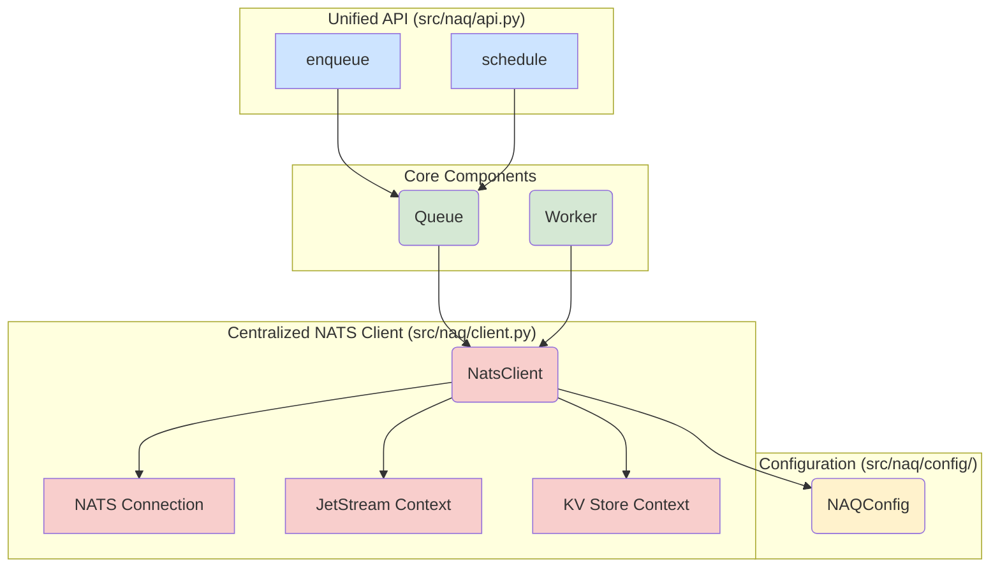

# NAQ Architectural Refactoring Plan

## 1. Introduction

This document outlines a detailed plan for refactoring the `naq` library. The primary goals are to simplify the architecture, eliminate unnecessary abstractions, and improve maintainability, while preserving the library's core strengths and its structural similarity to `rq`.

The key areas of focus are:
*   **Eliminating the service layer:** Removing the `ServiceManager` and its associated services.
*   **Consolidating the configuration system:** Migrating to the modern, schema-driven system in `src/naq/config/`.
*   **Unifying the API:** Merging the redundant `async_api.py` and `sync_api.py` modules.
*   **Simplifying the `Queue` and `Worker`:** Streamlining these core components.

## 2. Proposed Architecture

The proposed architecture eliminates the service layer and centralizes NATS interactions in a single, unified client. The `Queue` and `Worker` will interact directly with this client, significantly reducing complexity.

## 3. Refactoring Plan

### Phase 1: Service Layer Elimination

**Goal:** Remove the `ServiceManager` and all associated service classes, replacing them with a single, unified `NatsClient`.

**Steps:**

1.  **Create `NatsClient`:**
    *   Create a new file: [`src/naq/client.py`](src/naq/client.py).
    *   Implement a `NatsClient` class that encapsulates the NATS connection, JetStream context, and KV store context.
    *   This class will manage the NATS connection lifecycle (`connect`, `close`) and provide direct access to NATS features.

2.  **Deprecate and Remove Services:**
    *   Mark all classes in [`src/naq/services/`](src/naq/services/) as deprecated.
    *   In a subsequent step, remove the entire [`src/naq/services/`](src/naq/services/) directory.
    *   Remove [`src/naq/service_context.py`](src/naq/service_context.py).

3.  **Refactor `Worker` and `Queue`:**
    *   Modify the `Worker` and `Queue` classes to accept a `NatsClient` instance in their constructors.
    *   Replace all calls to `service_manager.get_service()` with direct calls to the `NatsClient` instance. For example, instead of `await self._service_manager.get_service("stream", StreamService)`, the code will use `await self.client.js.add_stream(...)`.

### Phase 2: Configuration System Consolidation

**Goal:** Consolidate all configuration into the modern, schema-driven system in `src/naq/config/` and remove the legacy `settings.py`.

**Steps:**

1.  **Migrate Settings:**
    *   Identify all settings defined in [`src/naq/settings.py`](src/naq/settings.py).
    *   For each setting, add a corresponding entry to the schema in [`src/naq/config/schema.py`](src/naq/config/schema.py) and the defaults in [`src/naq/config/defaults.py`](src/naq/config/defaults.py).
    *   Ensure the `ConfigLoader` in [`src/naq/config/loader.py`](src/naq/config/loader.py) can handle any necessary environment variable mappings.

2.  **Update Codebase:**
    *   Replace all imports from `naq.settings` with a centralized configuration object (e.g., `from naq.config import get_config`).
    *   Access configuration values through this object (e.g., `config.workers.ttl` instead of `DEFAULT_WORKER_TTL_SECONDS`).

3.  **Remove `settings.py`:**
    *   Once all references are removed, delete the [`src/naq/settings.py`](src/naq/settings.py) file.

### Phase 3: API Consolidation

**Goal:** Merge `src/naq/queue/async_api.py` and `src/naq/queue/sync_api.py` into a single, unified API.

**Steps:**

1.  **Create Unified API Module:**
    *   Create a new file: [`src/naq/api.py`](src/naq/api.py).
    *   Move the high-level functions (`enqueue`, `schedule`, etc.) from `async_api.py` to this new module.

2.  **Implement Synchronous Wrappers:**
    *   For each async function, provide a corresponding synchronous wrapper (e.g., `enqueue_sync`).
    *   These wrappers will use a simple mechanism (like `anyio.run`) to execute the async version in a blocking manner. This avoids the complexity of the current `run_with_service_context`.

3.  **Deprecate and Remove Old Modules:**
    *   Mark [`src/naq/queue/async_api.py`](src/naq/queue/async_api.py) and [`src/naq/queue/sync_api.py`](src/naq/queue/sync_api.py) as deprecated.
    *   In a subsequent step, remove these files.

### Phase 4: Queue and Worker Simplification

**Goal:** Streamline the `Queue` and `Worker` classes based on the removal of the service layer.

**Steps:**

1.  **Simplify `Worker`:**
    *   Remove the `_initialize_services` method from [`src/naq/worker/core.py`](src/naq/worker/core.py).
    *   The `Worker` will now receive a fully initialized `NatsClient`, eliminating the need for complex service initialization logic.
    *   Simplify the `_connect` method to use the `NatsClient` directly.

2.  **Simplify `Queue`:**
    *   Remove the `_ensure_services` method from [`src/naq/queue/core.py`](src/naq/queue/core.py).
    *   The `Queue` will also receive a `NatsClient`, simplifying its interaction with NATS.

## 4. Architectural Recommendations

*   **Embrace Composition over Inheritance:** The new `NatsClient` is a prime example of this. Instead of a complex hierarchy of services, we compose the necessary functionality in a single, focused class.
*   **Single Source of Truth:** The configuration system should be the single source of truth for all settings. The `settings.py` module created a confusing, dual-source system that is hard to reason about.
*   **Keep the Core API Stable:** While the internal architecture will change significantly, the external API of the `Queue` and `Worker` classes should remain as stable as possible to maintain compatibility with `rq`'s design patterns.

## 5. Conclusion

This refactoring plan will result in a more streamlined, maintainable, and performant `naq` library. By eliminating unnecessary abstractions and consolidating redundant code, we will create a stronger foundation for future development.